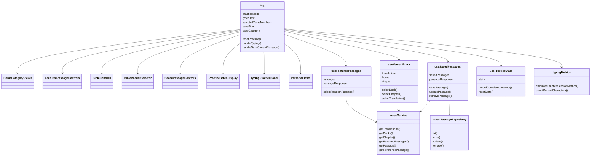

# The Word per Minute Architecture

Document version: `120626.1.b`
Last updated: 12/06/26
Update rule: only update this file when explicitly requested by the project owner.

## What This Version Updates

This version updates the architecture snapshot after the Home/category picker and saved-passage editing work.

It updates:

- the app modes to include Home,
- the product direction to describe Home as the starting point,
- Saved mode responsibilities to include editing saved passage title/category,
- component responsibilities for the new `HomeCategoryPicker`,
- saved passage hook and repository responsibilities to include metadata updates,
- the current file structure,
- the architecture diagram,
- known technical debt and likely next architecture steps.

## Previous Update: `120626.1.a`

This version creates the first architecture snapshot for the project.

It documents:

- the current app purpose and product direction,
- the current tech stack,
- the current React architecture,
- the three app modes: Featured, Bible, and Saved,
- the main file structure,
- the responsibilities of components, hooks, services, utilities, and data files,
- the current architecture diagram,
- known technical debt,
- likely next architecture steps.

Future updates to this document must include a short section explaining what changed in that documentation version.

## Version Format

Architecture document versions use this format:

```txt
ddmmyy.major.minor
```

Example:

```txt
120626.1.a
```

- `120626` means 12/06/26.
- `1` means the first major architecture snapshot for that day.
- `a` means the first small revision of that snapshot.

Suggested next versions:

- Small same-day documentation update: `120626.1.b`
- Larger same-day architecture update: `120626.2.a`
- First update on a new day: `ddmmyy.1.a`

## Project Purpose

The Word per Minute is a Bible typing practice app. The app helps users practise typing while reading, discovering, selecting, saving, and revisiting Bible passages.

The current product direction is:

- Home mode gives users a starting screen for choosing how to practise.
- Featured mode introduces users to curated passages.
- Bible mode lets users read chapters and select verses to save.
- Saved mode lets users practise their saved passages.

## Current Tech Stack

- Vite
- React
- TypeScript
- Tailwind CSS
- Local JSON Bible data
- `localStorage` for saved passages and personal best stats

No backend, database, authentication, or external Bible API is currently used.

## High-Level Architecture

The app currently follows a simple React architecture:

- Components handle UI rendering.
- Hooks manage reusable state and data-loading flows.
- Services provide API-shaped access to local data and browser storage.
- Utils handle pure calculations and formatting.
- Types define shared TypeScript data shapes.
- JSON data provides Bible translations, books, chapters, and featured passages.

This is not a class-heavy OOP app. The current design is closer to:

```txt
UI components -> hooks -> services -> local JSON / localStorage
```

## App Modes

### Home

Home mode is the current starting screen.

It:

- shows primary entry points for Featured, Bible, and Saved,
- shows featured passage categories generated from curated passage themes,
- starts a random featured passage when the user chooses Featured,
- starts a random featured passage from a chosen theme when the user chooses a category,
- opens the Bible reader,
- opens Saved mode when saved passages exist.

### Featured

Featured mode is the discovery/practice flow.

It:

- loads curated featured passages from local JSON,
- resolves passage references into real verse text,
- presents the passage as typing batches,
- calculates WPM and accuracy,
- allows saving the passage using its original title and category.

### Bible

Bible mode is the reader and passage-selection flow.

It:

- lets the user choose translation, book, and chapter,
- displays the whole chapter,
- lets the user click individual verses,
- lets the user drag-select verse ranges,
- lets the user save selected verses with a custom title and category,
- can open a random featured passage in context and scroll to the selected verses.

Bible mode does not currently show the typing input directly.

### Saved

Saved mode is the user's local passage library and practice flow.

It:

- reads saved passages from `localStorage`,
- displays saved passages as cards,
- supports category filtering,
- lets the user choose a saved passage to practise,
- lets the user edit saved passage title/category,
- lets the user remove saved passages.

## Main Runtime Flow

```txt
App starts
  -> loads Featured, Bible, Saved, and Stats hooks
  -> starts in Home mode
  -> user chooses Featured, Bible, Saved, or a Featured category
  -> resolves current passage/chapter data
  -> builds typing batches when needed
  -> renders mode controls
  -> renders typing panel for Featured/Saved
  -> records completed stats
```

## Main Files And Responsibilities

### `src/App.tsx`

Main coordinator for the app.

Responsibilities:

- tracks active mode: `home`, `featured`, `bible`, or `saved`,
- tracks typing state,
- tracks selected Bible verses,
- handles save title/category state,
- connects hooks to UI components,
- decides which controls and practice panels are visible,
- records completed attempts.

This file is currently the largest file and may eventually be worth splitting once the app flow stabilises.

### `src/components/HomeCategoryPicker.tsx`

Displays the Home starting screen.

Responsibilities:

- primary cards for Featured, Bible, and Saved,
- featured-theme category cards,
- disabled Saved state when no saved passages exist,
- sends selected direction/category back to `App`.

### `src/components/BibleControls.tsx`

Displays Bible reader controls.

Responsibilities:

- translation picker,
- book picker,
- chapter picker,
- random featured passage action.

### `src/components/BibleReaderSelector.tsx`

Displays the Bible chapter text.

Responsibilities:

- shows verse numbers,
- handles click-to-toggle verse selection,
- handles drag-to-select ranges,
- clears selection,
- scrolls to a selected passage when opened from random featured passage.

### `src/components/FeaturedPassageControls.tsx`

Displays Featured mode controls.

Responsibilities:

- next passage,
- reset current attempt.

### `src/components/SavedPassageControls.tsx`

Displays the saved passage library.

Responsibilities:

- category filter,
- saved passage cards,
- practice action,
- edit action,
- remove action,
- empty states.

### `src/components/PracticeBatchDisplay.tsx`

Shows the current typing batch and character-level progress.

### `src/components/TypingPracticePanel.tsx`

Shows typing input, WPM, accuracy, progress, and completion messaging.

### `src/components/PersonalBests.tsx`

Shows locally saved personal best stats.

## Hooks

### `src/hooks/useFeaturedPassages.ts`

Loads featured passage references and resolves the selected passage into verse text through `verseService`.

### `src/hooks/useVerseLibrary.ts`

Handles Bible reader state.

Responsibilities:

- selected translation,
- selected book,
- selected chapter,
- loaded chapter text,
- loading and error state.

### `src/hooks/useSavedPassages.ts`

Handles saved passage state.

Responsibilities:

- reading saved passages from storage,
- saving a passage,
- updating saved passage title/category,
- removing a passage,
- selecting a saved passage,
- resolving a saved passage into verse text.

### `src/hooks/usePracticeStats.ts`

Handles local typing stats.

Responsibilities:

- personal best WPM,
- personal best accuracy,
- completed attempt recording,
- stats reset.

## Services

### `src/services/verseService.ts`

Local Bible data service with an API-shaped interface.

Responsibilities:

- list translations,
- list books for a translation,
- load a chapter,
- list featured passages,
- resolve a featured passage,
- resolve a saved/custom passage reference.

This file is intentionally shaped like an API client so the app can later move from local JSON to hosted data without rewriting the UI.

### `src/services/savedPassageRepository.ts`

`localStorage` repository for saved passages.

Responsibilities:

- list saved passages,
- save a passage,
- update saved passage title/category,
- remove a passage.

This is the likely future swap point for a database-backed saved passage repository.

## Utilities

### `src/utils/practiceBatches.ts`

Splits verses into short typing batches.

### `src/utils/typingMetrics.ts`

Calculates:

- WPM,
- accuracy,
- progress,
- completion state,
- punctuation-normalised character matching.

### `src/utils/passageReference.ts`

Formats readable passage references, such as:

- `Matthew 5`
- `Matthew 5:3-10`
- `Genesis 1:1,3,5`

### `src/utils/errors.ts`

Converts unknown caught errors into displayable messages.

## Data Files

### `src/data/featuredPassages.json`

Curated passage list used by Featured mode and random featured passage in Bible mode.

### `src/data/translations.json`

List of available Bible translations.

Currently, the main available translation is local public-domain WEB data.

### `src/data/bibles/web`

Local World English Bible data.

Structure:

```txt
src/data/bibles/web/
  manifest.json
  books/
    Gen.json
    Exod.json
    ...
```

The manifest lets the app list books without loading the whole Bible at once.

## Important Types

### `src/types/featuredPassage.ts`

Defines featured passage references and resolved passage responses.

### `src/types/savedPassage.ts`

Defines saved passages and save inputs.

Saved passage sources currently include:

- `featured`
- `bible`
- `chapter` for old localStorage compatibility

### `src/types/verse.ts`

Defines Bible translation, book, chapter, and verse shapes.

### `src/types/practiceBatch.ts`

Defines the shape of a typing batch.

## Current File Structure

```txt
The-Word-per-Minute/
  docs/
    architecture.md
  public/
  scripts/
    importPublicDomainBible.mjs
  src/
    components/
      BibleControls.tsx
      BibleReaderSelector.tsx
      FeaturedPassageControls.tsx
      HomeCategoryPicker.tsx
      PersonalBests.tsx
      PracticeBatchDisplay.tsx
      SavedPassageControls.tsx
      TypingPracticePanel.tsx
    data/
      bibles/
        web/
          manifest.json
          books/
      featuredPassages.json
      translations.json
    hooks/
      useFeaturedPassages.ts
      usePracticeStats.ts
      useSavedPassages.ts
      useVerseLibrary.ts
    services/
      savedPassageRepository.ts
      verseService.ts
    types/
      featuredPassage.ts
      practice.ts
      practiceBatch.ts
      savedPassage.ts
      verse.ts
    utils/
      errors.ts
      passageReference.ts
      practiceBatches.ts
      typingMetrics.ts
    App.tsx
    index.css
    main.tsx
```

## Current Architecture Diagram



## Known Technical Debt

- `App.tsx` is doing a lot of orchestration and may eventually need splitting.
- Category management is still hardcoded/generated from featured themes.
- The app has local JSON Bible data only; no hosted API yet.
- User data is local-only through `localStorage`.
- The current architecture is beginner-friendly, but not yet deeply modular.
- Browser automation from this environment was blocked by the local Windows sandbox, so full click-through testing is still manual for now.

## Likely Next Architecture Steps

Suggested future steps:

1. Commit and review Home/category picker.
2. Browser-test the Home, Featured, Bible, and Saved flows manually.
3. Consider extracting mode-specific containers:
   - `HomeMode`
   - `FeaturedMode`
   - `BibleMode`
   - `SavedMode`
4. Consider a small `PassagePracticeController` hook if typing state keeps growing.
5. Keep `verseService` API-shaped so local JSON can later move to hosted data.
6. Keep saved passage storage behind `savedPassageRepository` so it can later move to a database.
7. Add automated tests later when the project is ready for test tooling.
