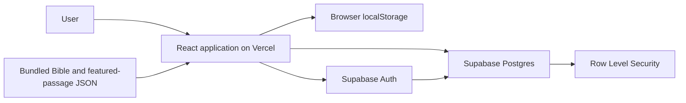
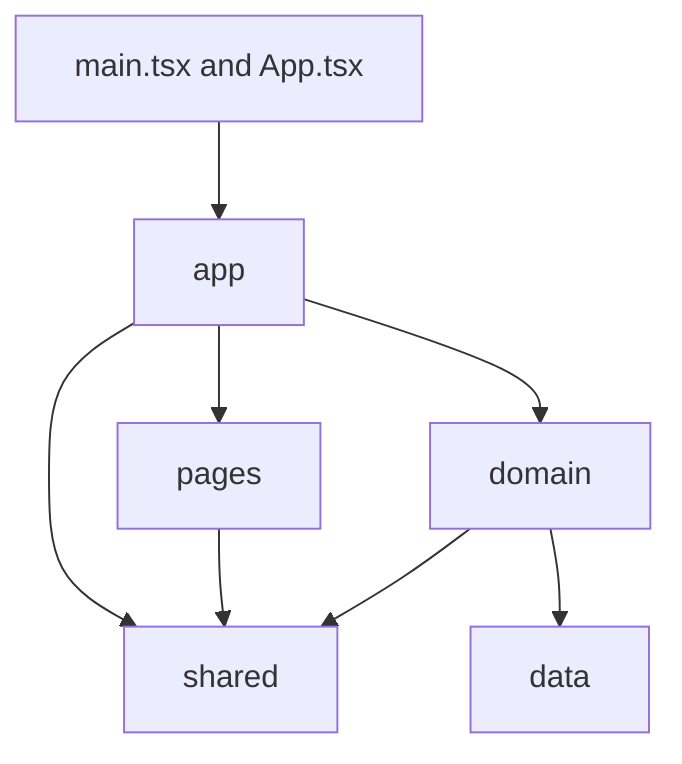
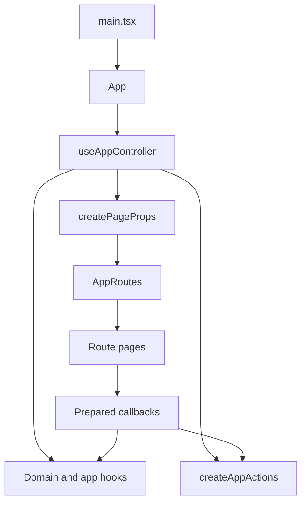
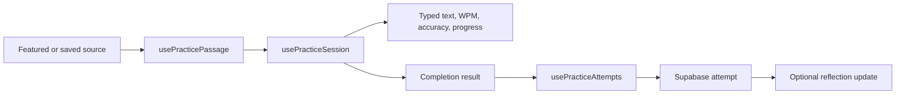

# Architecture

This document explains how The Word per Minute is structured, how its major runtime flows fit together, and where new code should belong. It describes stable system boundaries rather than cataloguing every source file.

For adjacent concerns, see:

- [`product-status.md`](product-status.md) for product direction, limitations, and priorities.
- [`data-and-security.md`](data-and-security.md) for storage, Supabase, RLS, and translation-data concerns.
- [`../CHANGELOG.md`](../CHANGELOG.md) for releases and earlier development history.

## Architectural Goals

The architecture aims to keep the application understandable as it grows while preserving these constraints:

- The passage remains the centre of the reading and typing experience.
- Page components stay focused on rendering and page-local interaction.
- Domain behaviour remains reusable across pages and independent of visual layout.
- Guest and authenticated persistence can change without duplicating page UI.
- Browser access to user data is protected by Supabase Auth and Row Level Security.
- Bible data can move from bundled JSON to another delivery mechanism without rewriting every consumer.
- Cross-feature coordination has an explicit home rather than leaking into unrelated hooks.

## System Context

The application is a client-rendered Vite single-page application hosted by Vercel. It has no custom Node or Express API.



The browser reads public scripture content from the application bundle. Guest saved passages remain in the current browser. Signed-in saved passages, practice attempts, and reflections are stored in Supabase.

## Technology Stack

### Application

- Vite for local development and production bundling.
- React and TypeScript for the client application.
- React Router for URL-based navigation.

### Interface

- Tailwind CSS v4 for utility styling and semantic theme tokens.
- Headless UI for accessible interactive primitives such as dialogs, disclosures, and popovers.
- Heroicons for contextual interface icons.

### Data and hosting

- Bundled JSON for the current WEB Bible and curated featured passages.
- Browser `localStorage` for guest saved passages.
- Supabase Auth and Postgres for account-owned data.
- Vercel for the static frontend and single-page-app routing fallback.

## Routes

Route paths are defined in `src/app/routes/appRoutePaths.ts` and rendered through React Router in `AppRoutes`.

| Path | Page | Responsibility |
| --- | --- | --- |
| `/` | Home | Introduces the product and routes users into reading, practice, Library, or Profile. |
| `/practice` | Practice | Selects a featured or saved source and runs the typing session. |
| `/bible` | Bible | Loads chapters, manages verse selection, and provides passage-saving context. |
| `/library` | Library | Filters, edits, removes, reads, and practises saved passages. |
| `/profile` | Profile | Presents account progress, paginated attempt history, and reflections. |

Unknown paths redirect to Home. Vercel rewrites direct route requests to `index.html`, allowing React Router to resolve the URL after the app loads.

## Source Structure

The repository is organised around four application layers plus static data and infrastructure:

```txt
src/
  app/                 application composition, routing, shell, and coordination
  pages/               route-level screens and page-specific visual components
  domain/              feature behaviour, hooks, stores, and pure domain utilities
  shared/              generic UI, types, utilities, and infrastructure clients
  data/                bundled Bible, translation, and featured-passage content
  App.tsx               root loading/error guard and routed application shell
  main.tsx              React and BrowserRouter entry point
  index.css             global CSS entry point and shared motion rules
  theme.css             semantic light and dark colour tokens

supabase/
  schema.sql            executable cloud schema, grants, functions, and RLS policies

scripts/
  importPublicDomainBible.mjs
```

This map is intentionally limited to architectural boundaries. The filesystem and nearby code are the source of truth for individual components.

## Layer Responsibilities



### `app`

The application layer owns concerns that span several pages or domains:

- route-to-mode navigation,
- global shell, header, footer, theme, and account controls,
- composition of domain hooks,
- cross-feature actions such as opening a saved passage in Bible,
- page-prop preparation,
- route-level loading and error guards,
- and state resets required when the active source or route changes.

It may depend on pages, domains, and shared code because it is the top-level composition layer. Feature-specific calculations and persistence should not be implemented here.

### `pages`

Each page folder owns one route-level screen and the components used only by that screen. Pages receive prepared data and callbacks through typed props.

Pages may own visual state such as an open editor, selected filter, or dialog visibility. They should not choose persistence adapters, query Supabase directly, or coordinate unrelated domains.

### `domain`

Domain folders group behaviour by concept:

- `auth` owns the authenticated session and account actions.
- `bible` owns scripture loading and reader selection.
- `featured-passages` owns the curated catalogue and category derivation.
- `saved-passages` owns passage identity, save forms, active storage, and persistence contracts.
- `practice` owns passage preparation, typing-session state, metrics, attempt persistence, and progress summaries.

Domain code can be used by more than one page even when its first consumer is a single screen. It should express product behaviour without depending on page markup.

### `shared`

Shared code is generic across several areas of the app:

- reusable UI primitives,
- cross-domain TypeScript contracts,
- generic formatting and error utilities,
- and infrastructure clients such as the configured Supabase browser client.

Shared code must not import from `app`, `pages`, or a specific domain. A component used once should remain page-local unless it represents a genuinely reusable convention.

### `data`

Static scripture and curated passage content belongs under `src/data`. Consumers access Bible content through the Bible domain service instead of importing individual book files into pages.

## Application Composition

`src/main.tsx` mounts the app inside `BrowserRouter`. `App` renders global loading and error states, the shared page shell, contextual headers, and the active route.

`useAppController` is the composition root for application state:



The controller should remain orchestration code. Its responsibilities are to instantiate independent state owners, derive cross-domain state, and connect their outputs. If a block can be understood and tested as Bible, saved-passage, practice, or authentication behaviour, it belongs in that domain instead.

### Cross-feature actions

`createAppActions` coordinates workflows that touch several state owners. Examples include:

- choosing a featured category and opening Practice,
- opening a saved passage in its Bible translation, book, chapter, and verse context,
- changing the reader location while clearing stale selection,
- and removing a saved passage while resetting the active practice session.

It is a plain factory rather than a React hook because it does not own React state or lifecycle behaviour.

### Page prop adapters

`createPageProps` converts domain and application state into explicit route-page contracts. This prevents pages from receiving the entire controller or learning how unrelated domains are structured.

## State Ownership

Each kind of state has one primary owner:

| Concern | Owner | Persistence |
| --- | --- | --- |
| Active route | React Router through `useAppNavigation` | Browser URL |
| Theme | `useTheme` | Browser storage |
| Account and session | `useAuthSession` | Supabase Auth session |
| Reader translation, book, and chapter | `useVerseLibrary` | Current runtime session |
| Selected reader verses | `useReaderSelection` | Current runtime session |
| Featured catalogue and selection | `useFeaturedPassages` | Bundled data plus runtime selection |
| Saved-passage collection | `useSavedPassages` | `localStorage` or Supabase, based on auth |
| Active practice passage | `usePracticePassage` | Derived from selected source |
| Typing text and live metrics | `usePracticeSession` | Current runtime session |
| Attempt history and reflections | `usePracticeAttempts` | Supabase for signed-in users |

State should not be duplicated in pages when it can be derived from these owners. Route or source changes reset practice through `useAppModeEffects` so typed text cannot carry into a different passage.

## Major Runtime Flows

### Startup and routing

1. Vite loads `main.tsx` and mounts React inside `BrowserRouter`.
2. `useAppNavigation` derives the application mode from the current URL.
3. `useAppController` composes authentication, Bible, featured-passage, saved-passage, and practice state.
4. `App` blocks the page tree only for route-critical loading or error states.
5. `AppRoutes` renders the page with a prepared, typed prop contract.

### Reading and saving

1. The Bible domain loads the selected translation manifest, book, and chapter.
2. Reader selection stores individual verses or a contiguous range independently from chapter data.
3. The save-input hook derives a complete saved-passage payload from the current app context.
4. The save form validates user-editable metadata and delegates persistence to `useSavedPassages`.
5. The active store writes to `localStorage` for a guest or Supabase for a signed-in user.

Library can reverse this flow by restoring a saved passage's reader location and verse selection before navigating to Bible.

### Practice and completion



`usePracticePassage` normalises the selected source into one typing target. `usePracticeSession` owns typing progress and metrics without knowing where the passage came from.

When a signed-in attempt completes, the app stores a passage identity and final metrics through the practice-attempt store. The returned attempt ID enables a later reflection update. A persistence failure does not make the already completed typing session incomplete.

### Authentication and storage switching

`useAuthSession` exposes the current Supabase session and account actions. `useSavedPassages` selects its storage implementation from the current user ID.

When authentication changes, the previous saved-passage list is cleared before the new store loads. This prevents guest records from appearing as cloud records that the signed-in user cannot edit. Local and cloud data are not merged automatically.

## Loading and Error Boundaries

The root app handles only failures that prevent the active route from rendering meaningful content. `useAppDisplayState` selects the relevant loading and error state for the current mode.

Recoverable operation failures stay close to the action that caused them:

- Library owns list and saved-passage mutation feedback.
- Practice owns attempt-save and reflection feedback.
- Profile owns history, pagination, and summary feedback.
- Passage-saving controls own their current save feedback.

Keeping these errors scoped avoids replacing an otherwise usable page because one independent request failed.

## Data and Security Boundary

The browser uses a publishable Supabase key and relies on Auth, Postgres grants, and RLS for account-data isolation. UI components interact with persistence through domain hooks and store contracts rather than the Supabase client directly.

The schema and security model are documented in [`data-and-security.md`](data-and-security.md). Exact database behaviour remains version-controlled in [`supabase/schema.sql`](../supabase/schema.sql).

## UI Foundations

`PageShell` owns the global header, navigation, account controls, content width, footer, theme toggle, and back-to-top control. Individual pages own only their route content.

The visual system uses semantic tokens rather than direct palette values for ordinary surfaces:

- `theme.css` maps light and dark CSS variables into Tailwind v4 tokens through `@theme inline`.
- `index.css` imports Tailwind and the theme, defines global motion helpers, reserves a stable scrollbar gutter, and honours `prefers-reduced-motion`.
- `shared/ui/Button.tsx` supplies the ordinary action hierarchy.
- Bespoke controls such as navigation tabs and verse buttons may retain local styling when their interaction differs from an ordinary button.
- Headless UI provides behaviour and accessibility for compound interactions; Tailwind controls their visual presentation.

The warm stone and restrained ember palette is a product convention. Detailed colour values remain authoritative in `theme.css` rather than being copied into documentation.

## Deployment

The production build runs:

```txt
npm run build
```

This performs a TypeScript project build followed by the Vite production build. Vercel serves the generated `dist` directory and applies the SPA rewrite in `vercel.json`.

The frontend requires `VITE_SUPABASE_URL` and `VITE_SUPABASE_PUBLISHABLE_KEY` in local and deployed environments. Secret Supabase keys are not part of the frontend architecture.

## Where New Code Belongs

Use these placement rules before creating another folder or abstraction:

- A new route-level screen belongs in `pages/<route>` and is wired through `AppRoutes`.
- Visual components used by one page stay inside that page's `components` folder.
- Behaviour named after a product concept belongs in the corresponding `domain` folder.
- Alternative persistence implementations belong behind a domain store contract.
- Coordination involving several domains belongs in `app`.
- A primitive or utility belongs in `shared` only when it is generic and reused or establishes a deliberate app-wide convention.
- Static scripture or curated catalogue content belongs in `data` and should be read through a domain boundary.
- Database changes belong in `supabase/schema.sql` and must preserve RLS for user-owned data.

Do not create wrapper components, hooks, or utility folders solely to satisfy the directory structure. A small amount of local code is preferable when it has no independent responsibility or reuse value.

## Architectural Guardrails

- Keep `useAppController` limited to composition and cross-feature derivation.
- Keep page contracts explicit rather than passing the entire app controller into screens.
- Keep page components unaware of storage implementations.
- Keep domain code independent from route markup.
- Keep `shared` free of imports from higher or feature-specific layers.
- Keep route paths centralised in `appRoutePaths.ts`.
- Keep Bible reads behind `verseService.ts` so content delivery can change later.
- Keep exact database rules in SQL rather than duplicated Markdown.
- Add an architecture decision record only when a choice is significant, has real alternatives, and would be expensive to reverse.
