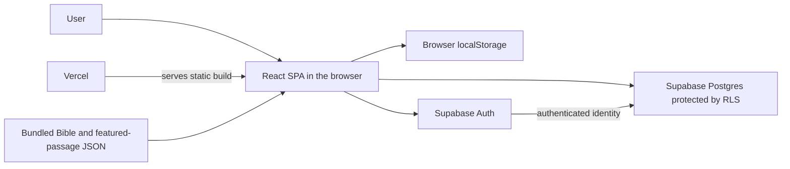
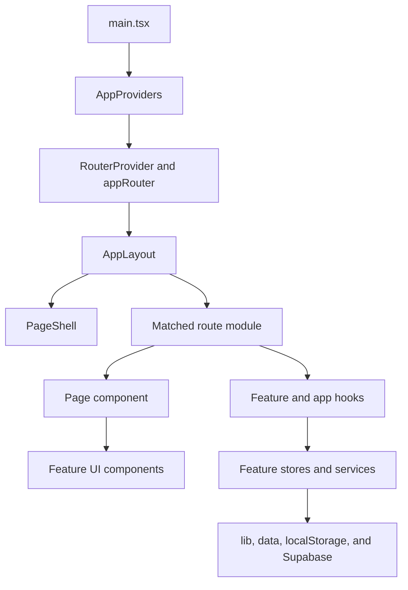
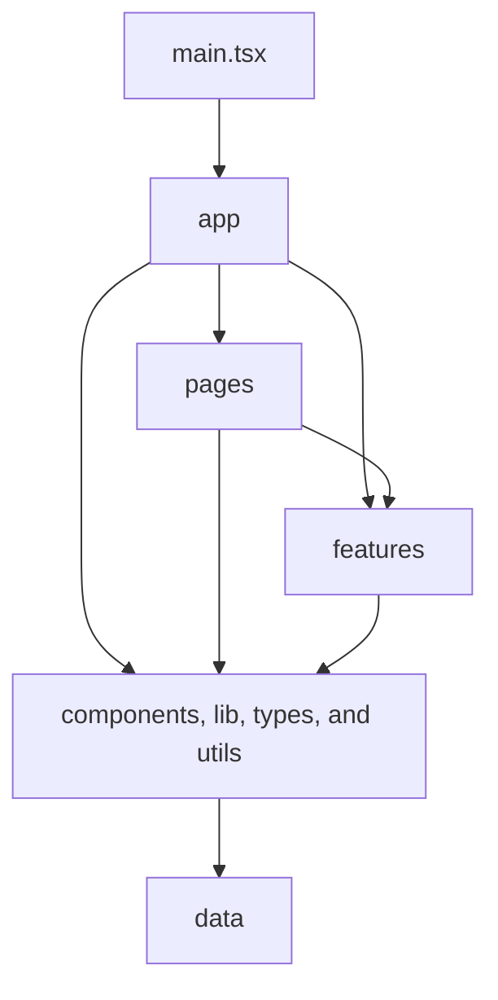
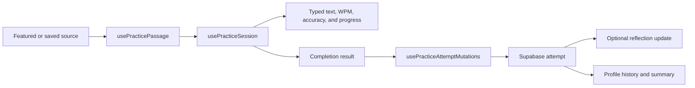

# Architecture

This document explains how The Word per Minute is structured, how its runtime flows fit together, and where new code should belong. It describes the current system boundaries rather than listing every source file.

For adjacent concerns, see:

- [`product-status.md`](product-status.md) for product direction, limitations, and priorities.
- [`data-and-security.md`](data-and-security.md) for storage, Supabase, RLS, and translation-data concerns.
- [`../CHANGELOG.md`](../CHANGELOG.md) for releases and earlier development history.

## Architectural Goals

The architecture aims to keep the application understandable as it grows while preserving these constraints:

- The passage remains the centre of the reading and typing experience.
- Each route initializes only the feature state and data it needs.
- Page components stay focused on rendering and page-local interaction.
- Product behaviour remains reusable without depending on route markup.
- Guest and authenticated persistence can change without duplicating page UI.
- Bible content delivery can change without rewriting every consumer.
- Cross-feature workflows have an explicit composition layer.
- User-owned browser data remains protected by Supabase Auth and Row Level Security.

## Architectural Style

The project is one client-side React application organised by feature, with route modules acting as composition roots. It is a modular frontend rather than a collection of independently deployed services.

The responsibilities resemble MVC without forcing React into a strict MVC framework:

- Feature hooks, stores, services, and pure utilities own product state and behaviour.
- Pages and feature components own rendering and local visual interaction.
- Route modules compose features, prepare page props, and coordinate navigation.

React Router owns URL state and route lifecycles. React hooks own local state and asynchronous effects. Supabase Auth providers own the limited state that must remain available across routes. No global state-management or server-state library is currently used.

## System Context

Vercel serves the production Vite build. The application then runs in the user's browser and communicates directly with bundled content, browser storage, and Supabase.


```mermaid
flowchart LR
  user["User"] --> browser["React SPA in the browser"]
  vercel["Vercel"] -->|serves static build| browser
  content["Bundled Bible and featured-passage JSON"] --> browser
  browser --> local["Browser localStorage"]
  browser --> auth["Supabase Auth"]
  browser --> database["Supabase Postgres protected by RLS"]
  auth -->|authenticated identity| database
```

There is no custom Node or Express API between the browser and Supabase. Node.js is used for development scripts and the Vite build, not as a production application server.

## Runtime Composition

`src/main.tsx` mounts providers and React Router. `AppLayout` renders the shared application shell once, and the matched route renders through its outlet.


```mermaid
flowchart TD
  main["main.tsx"] --> providers["AppProviders"]
  providers --> router["RouterProvider and appRouter"]
  router --> layout["AppLayout"]
  layout --> shell["PageShell"]
  layout --> route["Matched route module"]
  route --> hooks["Feature and app hooks"]
  route --> page["Page component"]
  page --> featureUI["Feature UI components"]
  hooks --> stores["Feature stores and services"]
  stores --> foundations["lib, data, localStorage, and Supabase"]
```

The application shell owns navigation, account controls, theme, content width, footer, and back-to-top behaviour. It does not initialize page feature state.

Route modules are the top-level composition boundary. They may import several independent features when a workflow requires them. Features do not import one another directly.

## Routes

Paths are defined in `src/app/routes/appRoutePaths.ts` and registered in `src/app/routes/appRouter.ts`.

| Path        | Route module    | Main responsibilities                                                                                                           |
| ----------- | --------------- | ------------------------------------------------------------------------------------------------------------------------------- |
| `/`         | `HomeRoute`     | Loads featured categories, account state, saved count, and entry-point navigation.                                              |
| `/practice` | `PracticeRoute` | Coordinates featured and saved sources, URL selection, the typing session, passage saving, attempt persistence, and reflection. |
| `/bible`    | `BibleRoute`    | Coordinates Bible loading, reader selection, URL state, featured discovery, and passage saving.                                 |
| `/library`  | `LibraryRoute`  | Loads and mutates saved passages and creates Bible or Practice navigation URLs.                                                 |
| `/profile`  | `ProfileRoute`  | Loads account identity, paginated practice history, and all-time summary data.                                                  |

Unknown paths redirect to Home. Vercel rewrites direct route requests to `index.html`, allowing React Router to resolve the URL after the application loads.

Bible and Practice route state is stored in URL query parameters. The route-state modules parse, normalize, resolve, and create canonical URLs independently from visual components.

## Source Structure

The tracked source tree uses feature folders plus a small set of shared foundations:

```txt
src/
  app/
    components/        application-shell and route-state UI
    hooks/             navigation, theme, category, and URL coordination
    layouts/           global route layout
    providers/         provider composition
    routes/            route composition and URL-state modules
  features/
    auth/
    bible-reader/
    featured-passages/
    practice/
    saved-passages/
  pages/               route-level screens
  components/          reusable UI primitives
  lib/                 shared infrastructure and content services
  types/               cross-feature TypeScript contracts
  utils/               generic cross-feature utilities
  data/                shared bundled Bible and translation data
  main.tsx              React and router entry point
  index.css             global CSS and shared motion rules
  theme.css             semantic light and dark colour tokens

supabase/
  schema.sql            intended cloud schema, grants, functions, and RLS

scripts/
  importPublicDomainBible.mjs
```

Feature-owned static content can stay inside its feature. The curated catalogue therefore lives under `features/featured-passages/data`, while shared Bible and translation data lives under `data`.

## Dependency Direction


```mermaid
flowchart TD
  entry["main.tsx"] --> app["app"]
  app --> pages["pages"]
  app --> features["features"]
  app --> foundations["components, lib, types, and utils"]
  pages --> features
  pages --> foundations
  features --> foundations
  foundations --> data["data"]
```

ESLint enforces the important boundaries:

- Features cannot import `app` or `pages`.
- Features cannot import other features.
- Pages cannot import `app`.
- Shared foundations cannot import `app`, `features`, or `pages`.

Cross-feature coordination belongs in `app`, normally in the route that owns the workflow. A reusable app-level hook is justified only when coordination is genuinely shared between routes.

### `app`

The application layer owns:

- router configuration and canonical paths,
- the global layout and provider composition,
- route-level loading and error guards,
- URL synchronization,
- and workflows that coordinate several features.

It may depend on pages, features, and shared foundations because it is the composition layer. Product calculations and persistence implementations should remain inside their feature.

### `pages`

Each page folder owns one route-level screen. Pages receive explicit state and callbacks from a route module and compose visual components.

Pages may import feature components and feature types. They should not:

- select persistence adapters,
- access Supabase directly,
- parse route URLs,
- or coordinate unrelated features.

Page-local state such as an open dialog, editor mode, filter, or expanded card can remain in the page or its visual components.

### `features`

Each feature owns one product capability:

- `auth` owns session and account actions.
- `bible-reader` owns chapter browsing and verse selection.
- `featured-passages` owns the curated catalogue and featured-passage retrieval.
- `saved-passages` owns passage identity, save forms, selection, and guest or cloud persistence.
- `practice` owns typing targets, session metrics, attempt persistence, history, and reflections.

A feature can contain components, hooks, stores, types, data, and pure utilities when those files serve the same capability. Features remain independent and are combined by routes.

### Shared foundations

The application uses several small top-level folders instead of one broad `shared` directory:

- `components` contains reusable UI primitives such as `Button`.
- `lib` contains infrastructure such as the Supabase client and the Bible content service.
- `types` contains contracts shared by multiple features.
- `utils` contains generic error and passage-reference helpers.

Code belongs here only when it is independent of a specific feature or establishes an app-wide convention. A component used once should remain local.

### `data`

`src/data` contains content shared through an infrastructure boundary, including translation metadata and bundled Bible files. Consumers request scripture through `src/lib/bible/verseService.ts` rather than importing book JSON directly.

## State Ownership

Each kind of state has one primary owner:

| Concern                               | Owner                                   | Persistence                       |
| ------------------------------------- | --------------------------------------- | --------------------------------- |
| Active route                          | React Router and `useAppNavigation`     | Browser URL                       |
| Bible and Practice selections         | Route-state modules and route hooks     | Browser URL                       |
| Theme                                 | `useTheme`                              | Browser storage                   |
| Account and session                   | `useAuthSession` through `AuthProvider` | Supabase Auth session             |
| Auth-menu visibility                  | `AuthMenuProvider`                      | Current runtime session           |
| Reader translation, book, and chapter | `useVerseLibrary`                       | Current route lifecycle           |
| Selected reader verses                | `useReaderSelection`                    | Bible URL and current route state |
| Featured catalogue                    | `useFeaturedPassageCatalog`             | Bundled data                      |
| Active featured passage               | `useSelectedFeaturedPassage`            | Current Practice route state      |
| Saved-passage collection              | `useSavedPassageCollection`             | `localStorage` or Supabase        |
| Active saved passage                  | `useSelectedSavedPassage`               | Current route state               |
| Typing text and live metrics          | `usePracticeSession`                    | Current Practice route lifecycle  |
| Attempt history and summary           | `usePracticeAttemptHistory`             | Supabase                          |
| Attempt and reflection writes         | `usePracticeAttemptMutations`           | Supabase                          |

State should not be copied into pages when it can be derived from these owners. Navigating away from a route unmounts its route-specific state.

## Major Runtime Flows

### Startup and routing

1. Vite loads `main.tsx`.
2. `AppProviders` initializes authentication and account-menu providers.
3. `RouterProvider` selects a child of `AppLayout`.
4. `AppLayout` renders `PageShell` and the route outlet.
5. The matched route initializes only its feature hooks and renders its page.

### Reading and saving

1. `useVerseLibrary` requests translation, book, and chapter data through `verseService`.
2. `useBibleRouteSelection` keeps the reader state and canonical Bible URL synchronized.
3. `useReaderSelection` owns the selected verses and focus target.
4. `createBiblePassageSaveInput` derives a complete saved-passage payload.
5. `useSavePassageForm` handles editable metadata.
6. `useSavedPassageCollection` writes through the local or Supabase store selected from the current user ID.

Library reverses part of this flow by creating a Bible URL from a saved passage's translation, book, chapter, and verse identity.

### Practice and completion


```mermaid
flowchart LR
  source["Featured or saved source"] --> passage["usePracticePassage"]
  passage --> session["usePracticeSession"]
  session --> metrics["Typed text, WPM, accuracy, and progress"]
  session --> result["Completion result"]
  result --> mutations["usePracticeAttemptMutations"]
  mutations --> cloud["Supabase attempt"]
  cloud --> reflection["Optional reflection update"]
  cloud --> history["Profile history and summary"]
```

`PracticeRoute` coordinates the selected source and creates persistence inputs. `usePracticePassage` normalizes either source into one typing target. `usePracticeSession` calculates live metrics without knowing where the passage came from.

For a signed-in user, a completed result is stored through the attempt store. The returned attempt ID allows an optional reflection update. A cloud failure does not make the already completed typing session incomplete.

### Authentication and storage switching

`useAuthSession` exposes the current Supabase session and account actions. `useSavedPassageCollection` selects local or Supabase persistence from the current user ID.

When authentication changes, the previous in-memory saved-passage list is cleared before the new store loads. Guest and cloud data are intentionally not merged automatically.

## Loading and Error Boundaries

Routes handle failures that prevent their page from rendering meaningful content. Recoverable operation failures stay near the action that caused them:

- Library owns list and saved-passage mutation feedback.
- Bible owns chapter and passage-save feedback.
- Practice owns passage, attempt-save, and reflection feedback.
- Profile owns history, pagination, and summary feedback.

`AppRouteErrorBoundary` handles unexpected route render failures. Expected data and mutation failures remain explicit states rather than thrown application errors.

## Data and Infrastructure Boundaries

UI components do not call Supabase, `localStorage`, or Bible JSON directly.

- Feature hooks choose and use store implementations.
- Store contracts keep local and cloud persistence interchangeable.
- `src/lib/supabase/client.ts` exposes the browser-safe typed Supabase client.
- `src/lib/bible/verseService.ts` exposes an API-shaped boundary over bundled content.

The browser uses a Supabase publishable key and relies on Auth, grants, and RLS for user-data isolation. Exact data ownership and schema behaviour are documented in [`data-and-security.md`](data-and-security.md).

## UI Foundations

`PageShell` owns the global header, navigation, account controls, content width, footer, theme toggle, and back-to-top control.

The visual system uses semantic theme tokens:

- `theme.css` maps light and dark CSS variables into Tailwind v4 tokens.
- `index.css` loads Tailwind, shared motion rules, stable scrollbar behaviour, and reduced-motion handling.
- `components/ui/Button.tsx` supplies the ordinary action hierarchy.
- Headless UI supplies accessible behaviour for compound controls while Tailwind controls their appearance.

## Current Architectural Constraints

The structure is stable, but several implementation tradeoffs remain:

- Practice initializes featured and saved source state together, which can load the inactive source.
- Route remounting can repeat data requests because the app has no shared server-state cache.
- Route modules are statically imported, so the initial JavaScript bundle contains code for every route.
- `PracticeRoute` remains the largest route composition module and should be reduced only through cohesive, testable feature behaviour.
- `useBibleRouteSelection` remains long because it exposes the reader's URL-backed event handlers, but its pure fallback and bounds rules are isolated and tested in `bibleRouteState`.
- Database types are manually maintained and Supabase changes use one schema file rather than versioned migrations.
- Automated tests cover important pure logic but not yet the highest-risk route, store, and authenticated flows.

These constraints should be addressed through focused changes. They do not justify reintroducing a global controller or adding a state library by default.

## Where New Code Belongs

Use these placement rules before creating another abstraction:

- A new screen belongs in `pages/<route>` and receives an accompanying composition module in `app/routes`.
- Route parsing and canonical URL creation belong beside the route in `app/routes`.
- Visual components used by one page stay in that page or its feature.
- Product behaviour belongs in the corresponding feature.
- Cross-feature workflows belong in the route that owns the workflow.
- Alternative persistence implementations belong behind a feature store contract.
- Generic UI, infrastructure, contracts, and helpers belong in `components`, `lib`, `types`, or `utils`.
- Shared Bible and translation content belongs in `data` and remains behind `verseService`.
- Feature-owned static content can remain inside the feature.
- Database changes belong in `supabase/schema.sql` until migrations are adopted.

Do not create wrappers, hooks, factories, or utility folders solely to satisfy the directory structure. A small amount of local code is preferable when it has no independent responsibility or reuse value.

## Architectural Guardrails

- Keep route modules responsible for composition, navigation, and cross-feature coordination.
- Keep features independent from other features, pages, and app code.
- Keep page contracts explicit rather than passing whole hook result objects.
- Keep page components unaware of persistence implementations.
- Keep shared foundations free of feature-specific behaviour.
- Keep route paths centralized in `appRoutePaths.ts`.
- Keep scripture reads behind `verseService`.
- Keep user-owned browser data behind store contracts and Supabase RLS.
- Extract logic from a large file only when the extracted unit has a clear responsibility or independent test value.
- Add an architecture decision record only when a choice has meaningful alternatives and would be expensive to reverse.
