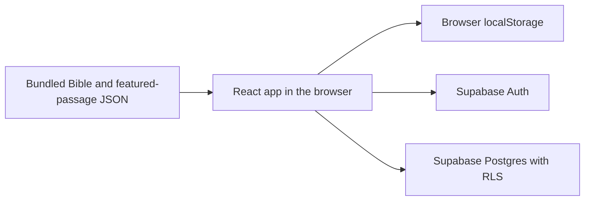
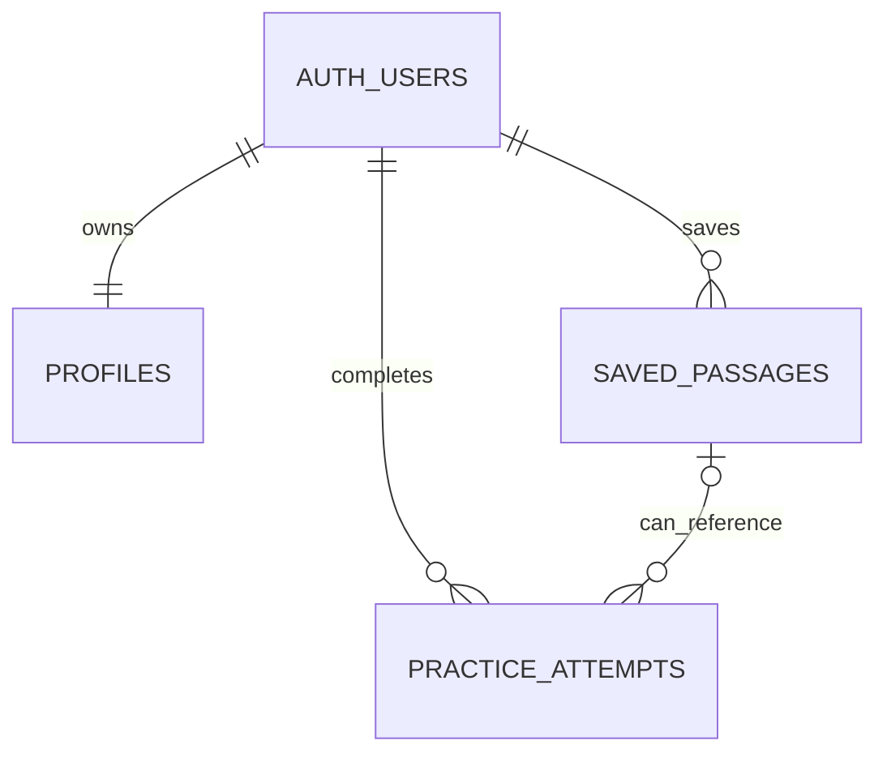
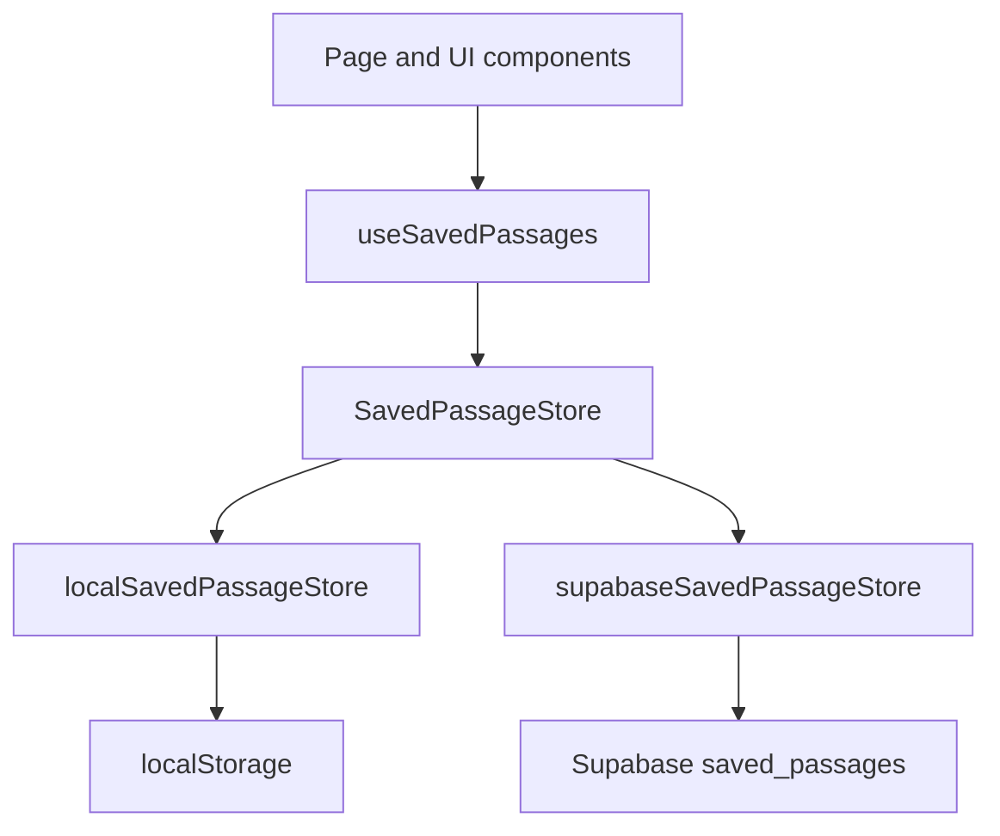
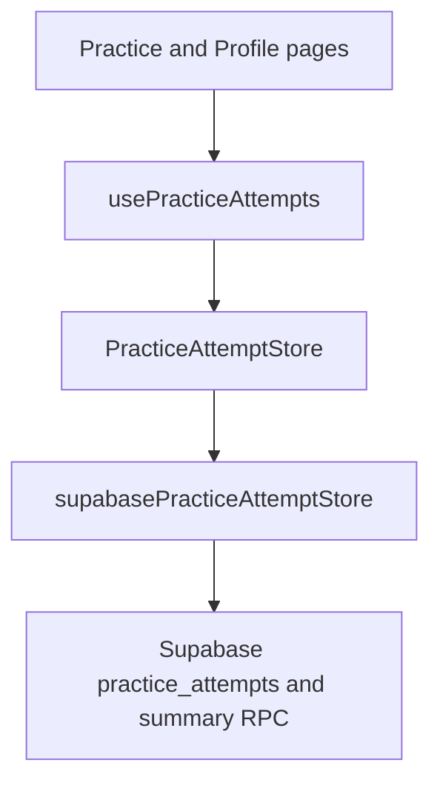

# Data, Storage, and Security

This document explains what data the application handles, where it lives, who can access it, and which lifecycle limitations still exist. It describes the intended data boundaries rather than duplicating every implementation detail.

[`supabase/schema.sql`](../supabase/schema.sql) records the intended current cloud schema, constraints, indexes, grants, database functions, and Row Level Security policies. Database changes are currently applied to Supabase manually; versioned migrations have not yet been adopted. Product priorities and future work live in [`product-status.md`](product-status.md).

## Data Landscape

The application uses bundled content, browser-local storage, Supabase Auth, and Supabase Postgres:



- Bundled JSON contains public scripture and curated passage data.
- Browser `localStorage` contains saved passages belonging to the current guest browser.
- Supabase Auth owns accounts and sessions.
- Supabase Postgres contains signed-in users' profiles, saved passages, practice attempts, and reflections.

Bible text is not currently uploaded to Supabase. The first cloud-data phase is limited to user-owned information.

## Trust Boundary and Configuration

The Vite application communicates directly with Supabase from the browser. This is an intentional architecture: database access is protected through authentication, table grants, and Row Level Security rather than by hiding the browser client.

The frontend requires:

```txt
VITE_SUPABASE_URL
VITE_SUPABASE_PUBLISHABLE_KEY
```

Vite exposes variables prefixed with `VITE_` to browser code. The Supabase publishable key is designed for this use and may be configured in local development and Vercel.

Supabase secret keys provide privileged backend access and must never be:

- prefixed with `VITE_`,
- added to frontend code,
- committed to the repository,
- or configured for the client-side Vercel build.

`.env.example` records required variable names without values. Real local values belong in `.env.local`, which is excluded by the repository's `*.local` ignore rule.

## Data Ownership by Session

The active saved-passage store depends on authentication state:

| Session | Saved passages | Practice history |
| --- | --- | --- |
| Signed out | Current browser's `localStorage` | Not persisted |
| Signed in | Current user's Supabase rows | Current user's Supabase rows |

Guest and account data are deliberately separate:

- Signing in does not silently upload or merge local saved passages.
- The app clears the previous store's in-memory list before loading the newly active store.
- Local passages are not shown while signed in, avoiding records that the active cloud store cannot edit or delete.
- A future import flow must be explicit and should handle duplicates before writing to the account.

## Data Inventory

The application currently handles these categories of data:

| Data | Location | Notes |
| --- | --- | --- |
| Bible text, translation metadata, and featured passages | Application bundle | Public content stored in the repository. |
| Guest saved passages | Browser `localStorage` | Includes passage identity, title, category, source, and creation time. |
| Theme preference | Browser `localStorage` | Stores the current light or dark preference. |
| Authentication account and session | Supabase Auth and browser session storage | Supabase Auth handles email addresses, password credentials, confirmation, and session tokens. Passwords are not stored in the app's public tables. |
| Profile | Supabase Postgres | Currently contains the Auth user ID, optional display name, and timestamps. |
| Account saved passages | Supabase Postgres | Contains passage identity, title, category, source, translation metadata, exact verse selection, and timestamps. |
| Practice attempts | Supabase Postgres | Contains passage identity, duration, mistakes, typed-character count, WPM, accuracy, and completion time. |
| Reflections | Supabase Postgres | Optional user-written text attached to a practice attempt. |

Reflections and account activity should be treated as private user content. The application does not intentionally expose one account's records to another account.

## Cloud Data Model



The diagram shows ownership and optional references only. Exact columns and constraints remain defined in `supabase/schema.sql`.

### Profiles

Each Supabase Auth user receives one matching `profiles` row. A database trigger creates it when the account is created. `display_name` is optional, so a newly created profile may validly contain `null` until profile editing is added.

Deleting the Auth user at the database or project-administration level cascades to the profile and other user-owned rows. The application does not yet provide self-service account deletion.

### Saved passages

`saved_passages` stores one user's saved passage identity, display metadata, translation information, exact verse selection, source, and timestamps.

The database prevents the same user from saving the same translation, book, chapter, range, and selected-verse combination more than once. Different users can independently save the same passage.

### Practice attempts

`practice_attempts` stores completed typing metrics and the passage identity needed to understand the attempt later. Each attempt contains at least one source reference: a saved passage, a featured passage, or both. A saved-passage reference becomes `null` if that saved passage is later deleted, preserving the historical attempt itself.

Reflections remain nullable and can be added or changed after completion. Attempts currently have no browser-accessible delete operation.

### Practice summary

`get_practice_attempt_summary()` calculates all-time completed attempts, reflection count, best WPM, and average accuracy for the authenticated user. It runs with the caller's permissions, so the existing RLS policies continue to limit its data.

Profile history is loaded separately in pages of 20 recent attempts. Pagination limits the amount rendered at once without limiting the all-time summary.

## Row Level Security

RLS is enabled for every user-owned public table. Access requires both a Postgres grant and an applicable RLS policy:

- Grants determine which table operations the authenticated role may attempt.
- RLS determines which rows the current authenticated user may access.

Current policy intent:

| Data | Allowed operations |
| --- | --- |
| Own profile | Select, insert, and update |
| Own saved passages | Select, insert, update, and delete |
| Own practice attempts | Select and insert |
| Own practice reflection | Update the `reflection` column |

The policies compare `auth.uid()` with the row owner. A publishable key without an authenticated user does not grant access to another user's data.

Practice-attempt updates are intentionally narrower than the row-level policy alone: the authenticated role receives column-level update permission for `reflection`, not general update permission for stored metrics.

RLS isolates ordinary browser users from one another. It does not restrict trusted project administrators or properly secured backend credentials with privileged database access. Supabase secret keys therefore require stricter handling than the browser-safe publishable key.

Automated RLS policy tests are not currently part of the repository. Policy behaviour must be verified manually when the schema changes until that coverage exists.

## Data Lifecycle and User Controls

Current deletion and retention behaviour is limited:

- Guest saved passages remain in the current browser until the user removes them or clears that site's browser storage.
- Signed-in users can remove individual saved passages.
- Removing a saved passage preserves associated historical practice attempts by setting their saved-passage reference to `null`.
- Users can replace or clear reflection text; an empty reflection is stored as `null`.
- Practice attempts cannot currently be deleted through the application.
- The application does not yet provide account-data export or self-service account deletion.
- No formal retention period has been defined for account data.

Deleting a Supabase Auth user through an authorised administrative process cascades to their profile, saved passages, and practice attempts because those records reference the Auth user with `on delete cascade`.

These limitations should be resolved or explicitly reflected in the public privacy information before the product is considered beta-ready.

## Frontend Storage Boundaries

UI components do not call `localStorage` or Supabase persistence directly. Domain hooks depend on store contracts, and the active implementation is selected outside the visual components.

### Saved passages



This boundary keeps list, add, edit, and remove behaviour consistent while allowing guest and account persistence to remain different.

### Practice attempts



Completed signed-in attempts are sent to the cloud store. Attempt-save, history, reflection, pagination, and summary failures are kept as separate domain states so one failure does not incorrectly invalidate unrelated data.

A failed history save does not turn a completed typing session into a failed session. A reflection cannot be attached until the corresponding cloud attempt exists.

## Schema and Type Workflow

The repository currently uses a manual database workflow:

- `supabase/schema.sql` records the intended current schema and the setup/update SQL used during the initial backend phase.
- Schema changes are run manually against the Supabase project.
- The repository does not yet contain timestamped Supabase migrations or a local Supabase configuration.
- `src/shared/types/database.ts` mirrors the database contract and is currently maintained manually rather than generated from Supabase.

Every schema change must therefore update both `supabase/schema.sql` and `src/shared/types/database.ts`, then be applied and verified against the remote project. The repository alone cannot currently prove which SQL changes have already been applied to production.

Adopting versioned migrations, generated database types, local schema replay, and automated RLS checks is future maintenance work. Until then, `schema.sql` describes the intended state while the deployed Supabase project remains the runtime state.

## Bundled Content

The repository currently provides:

```txt
src/data/
  featuredPassages.json
  translations.json
  bibles/
    web/
      manifest.json
      books/
        Gen.json
        Exod.json
        ...
```

- `featuredPassages.json` contains curated passage identities and broad themes.
- `translations.json` describes translations available to the reader.
- `bibles/web` contains the local World English Bible manifest and book files.

`src/domain/bible/verseService.ts` provides an API-shaped read boundary over these files. Pages should request scripture through that service rather than importing individual book JSON files.

## Additional Translation Requirements

Adding another translation is not only a UI change. Before scripture moves to hosted storage or another translation is bundled, the project must define:

- licensing and redistribution rights,
- required copyright and attribution display,
- a stable translation identifier,
- book and verse identity across translation-specific differences,
- storage and delivery strategy,
- saved-passage behaviour when a translation becomes unavailable,
- and whether users can practice or reopen a passage in a different translation.

The current saved-passage and practice-attempt records include translation and passage identity fields so this work can remain incremental. They do not yet represent a complete multi-translation content model.

## Authentication URLs

Supabase Auth must allow the environments used by email confirmation and future password recovery flows.

Local development:

```txt
http://localhost:5173
```

Production:

```txt
https://thewordperminute.com
```

The canonical Supabase Site URL should use the production domain. Localhost must remain in the allowed redirect list for local confirmation flows. Vercel preview URLs should be allowed only if authentication is deliberately tested in preview deployments.

These settings live in the Supabase dashboard rather than this repository. Changes should be verified in each allowed environment before relying on confirmation or future password-recovery links.

## Security Invariants

Future changes should preserve these rules:

- Never expose a Supabase secret key to the Vite application.
- Keep RLS enabled for every user-owned table exposed through the Data API.
- Scope every user-owned query and mutation to the authenticated user through policy, not UI assumptions.
- Record every intended database change in version-controlled SQL and keep the deployed project aligned with it.
- Keep `src/shared/types/database.ts` aligned with the deployed schema until generated types are adopted.
- Keep persistence details behind domain store contracts rather than page components.
- Never merge guest data into an account without an explicit user action and duplicate strategy.
- Do not host or redistribute additional Bible translations until licensing and attribution are resolved.
