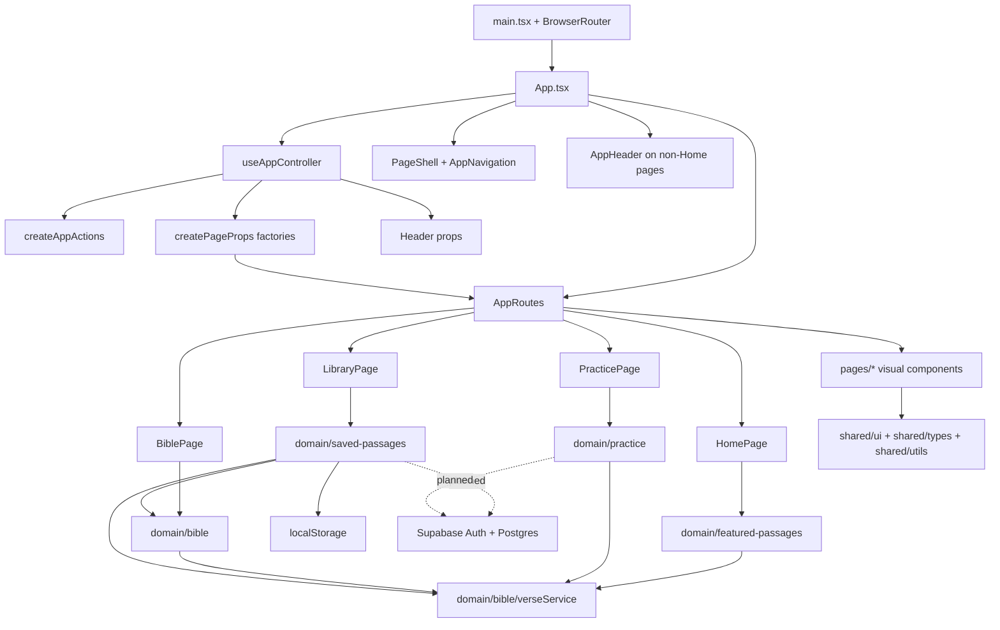

# The Word per Minute Documentation

Document version: `260705.1.d`
Last updated: 05/07/26
Update rule: only update this file when explicitly requested by the project owner.

## Purpose

The Word per Minute is a Bible typing practice app. It helps users practise typing while reading, discovering, selecting, saving, and revisiting Bible passages.

The current product direction is:

- Home introduces the app and lets users choose a practice direction.
- Practice is the central typing page.
- Featured passages introduce users to curated scripture.
- Bible lets users read chapters and select verses to save.
- Library lets users manage saved passages.
- Saved passages can be practised from Practice.

Version history and documentation update notes live in `docs/update-notes.md`.

## Tech Stack

- Vite
- React
- TypeScript
- React Router
- Tailwind CSS
- Local JSON Bible data
- Supabase JavaScript client, not yet wired into runtime data flows
- `localStorage` for saved passages, personal best stats, and theme preference

No backend database, authentication flow, or external Bible API is currently used in production. Supabase/Postgres is the planned backend direction, and the browser client configuration now exists behind environment variables.

## High-Level Architecture

The app uses URL-based React routing with page folders, domain modules, shared primitives, and a central app controller.

```txt
URL route -> App shell -> app controller -> page-prop factories -> page component -> page UI
                                           -> domain hooks/services
```

The main architecture layers are:

- `src/app`: app-level shell, routing, controllers, navigation, and coordination hooks.
- `src/pages`: screen-level pages and page-owned visual components.
- `src/domain`: app concepts, data access, persistence, hooks, calculations, and business rules.
- `src/shared`: generic UI primitives, utilities, and TypeScript data shapes.
- `src/data`: local Bible and featured-passage JSON data.
- `src/theme.css`: semantic light/dark color tokens exposed through Tailwind.
- `public/brand`: theme-aware application symbol assets.
- `vercel.json`: Vercel SPA route rewrite configuration.

## Routes

The app is a single page app with proper URL routes:

```txt
/          Home
/practice  Practice
/bible     Bible
/library   Library
```

`BrowserRouter` is installed in `src/main.tsx`.

`src/app/components/AppRoutes.tsx` maps paths to pages:

```txt
/          -> HomePage
/practice  -> PracticePage
/bible     -> BiblePage
/library   -> LibraryPage
```

`useAppNavigation` derives the current `appMode` from the URL path. The URL is the source of truth for which screen is active.

## App Pages

### Home

Home is the starting screen.

It:

- shows primary entry points for Practice, Bible, and Library,
- shows animated counters for curated and saved passage counts,
- starts a random featured passage,
- starts a random featured passage from a chosen category,
- presents featured categories as a balanced desktop grid,
- opens the Bible reader,
- opens Library when saved passages exist.

### Practice

Practice is the central typing flow.

It:

- practises a featured passage or saved passage,
- treats the selected verses as one continuous typing passage,
- displays the passage in a fixed-height viewport that users cannot scroll manually,
- automatically scrolls the passage to keep the active typing position visible,
- keeps the typing input at a consistent fixed height,
- calculates WPM continuously while an attempt is active,
- counts typing mistakes in accuracy even when the user later corrects them,
- treats deletion as neutral rather than as an additional mistake,
- freezes the final WPM and accuracy when the passage is completed,
- records personal bests locally,
- allows featured passages to be saved from the Practice controls,
- lets users switch between Featured and Saved practice sources,
- presents source and saved-passage controls in a responsive, label-first layout,
- shows WPM, accuracy, progress, and status as one quiet horizontal summary instead of separate dashboard cards.

### Bible

Bible is the reader and passage-selection flow.

It:

- lets the user choose translation, book, and chapter,
- displays the whole chapter,
- lets the user click individual verses,
- lets the user drag-select verse ranges,
- treats an empty verse selection as the whole current chapter,
- lets the user save selected verses with a custom title and category,
- lets the user save the whole chapter when no individual verses are selected,
- can open a random featured passage in context,
- waits for the selected chapter to render before scrolling to highlighted verses,
- uses a softer selected-verse treatment in light mode while retaining strong dark-mode contrast.

Bible does not show typing input directly.

### Library

Library is the saved-passage management flow.

It:

- reads saved passages from `localStorage`,
- displays saved passages as cards,
- supports search by title, reference, category, book, or translation,
- supports category filtering,
- supports source filtering by All sources, Featured, or Saved,
- lets the user practise a saved passage,
- lets the user open a saved passage in its original Bible context,
- restores exact custom verse selections when opening them in Bible,
- highlights the full range for saved featured passages,
- opens whole-chapter saves without individual verse highlighting,
- lets the user edit saved passage title/category,
- lets the user remove saved passages,
- shows clearer card metadata, source labels, saved dates, and active practice state,
- separates passage actions from edit/remove actions,
- gives removal a restrained destructive treatment.

Library does not show typing input directly.

## App Runtime Flow

```txt
main.tsx
  -> BrowserRouter
  -> App.tsx
    -> calls useAppController
      -> derives appMode from URL
      -> loads feature hooks
      -> builds display state
      -> builds cross-page actions
      -> prepares page props through plain factory functions
    -> renders PageShell with sticky branded navigation and floating utility controls
    -> renders AppHeader on non-Home pages
    -> renders AppRoutes
      -> renders HomePage, PracticePage, BiblePage, or LibraryPage
```

`App.tsx` is mostly the app shell. App-wide coordination lives in `src/app/controllers/useAppController.ts`. Cross-page actions are created by `createAppActions.ts`, while page-specific prop wiring is grouped into the plain factory functions in `createPageProps.ts`.

The controller composes domain hooks and services, then passes prepared data and callbacks into page components. Page folders should stay mostly visual; domain folders should own app rules, persistence, transformations, and reusable data behaviour.

Home intentionally hides `AppHeader` so the Home hero is the first page content. Practice, Bible, and Library still show the contextual page title/reference area.

## Current File Structure

```txt
src/
  app/
    components/
      AppErrorState.tsx
      AppFooter.tsx
      AppHeader.tsx
      AppLoadingState.tsx
      BackToTopButton.tsx
      AppRoutes.tsx
      AppNavigation.tsx
      PageShell.tsx
      PassageSaveControls.tsx
    controllers/
      createAppActions.ts
      createPageProps.ts
      useAppController.ts
    hooks/
      useAppDisplayState.ts
      useAppModeEffects.ts
      useAppNavigation.ts
      useTheme.ts
    routes/
      appRoutePaths.ts
  domain/
    auth/
      checkSupabaseConnection.ts
    bible/
      hooks/
        useReaderSelection.ts
        useVerseLibrary.ts
      verseService.ts
    featured-passages/
      hooks/
        useFeaturedPassages.ts
        usePassageCategories.ts
    practice/
      hooks/
        usePracticePassage.ts
        usePracticeSession.ts
        usePracticeStats.ts
      utils/
        practicePassage.ts
        typingMetrics.ts
    saved-passages/
      hooks/
        usePassageSaveInput.ts
        useSavePassageForm.ts
        useSavedPassages.ts
      savedPassageCategories.ts
      savedPassageRepository.ts
  pages/
    bible/
      components/
        BibleChapterReader.tsx
        BibleReaderControls.tsx
      BiblePage.tsx
    home/
      HomePage.tsx
    library/
      components/
        SavedPassageCard.tsx
        SavedPassageFilters.tsx
        SavedPassageLibrary.tsx
      LibraryPage.tsx
    practice/
      components/
        FeaturedSaveAction.tsx
        PersonalBests.tsx
        PracticeActionButtons.tsx
        PracticeControls.tsx
        PracticePassageDisplay.tsx
        SavedPassageSelect.tsx
        SourcePicker.tsx
        TypingPracticePanel.tsx
      PracticePage.tsx
  shared/
    lib/
      supabaseClient.ts
    types/
      app.ts
      featuredPassage.ts
      practice.ts
      savedPassage.ts
      verse.ts
    ui/
      Button.tsx
    utils/
      errors.ts
      passageReference.ts
  data/
    bibles/
    featuredPassages.json
    translations.json
  App.tsx
  index.css
  main.tsx
  theme.css

public/
  brand/
    symbol-dark.svg
    symbol-light.svg
  favicon.svg

.env.example
vercel.json
```

## Key Files And Responsibilities

### `src/main.tsx`

Mounts React and wraps the app in `BrowserRouter`.

### `src/App.tsx`

Renders the app shell.

Responsibilities:

- calls `useAppController`,
- renders loading and error states,
- renders `PageShell` with global navigation/theme state,
- renders `AppHeader` on non-Home pages,
- renders `AppRoutes`.

### `src/app/controllers/useAppController.ts`

Coordinates app-wide state and cross-feature wiring.

Responsibilities:

- derives `appMode` through `useAppNavigation`,
- keeps `practiceSource` state,
- loads feature hooks,
- builds the active continuous practice passage,
- builds display labels/loading/error state,
- builds cross-page actions,
- prepares header props,
- prepares routed page props through plain factory functions.

### `src/app/controllers/createAppActions.ts`

Creates the cross-page action functions used to coordinate navigation and multiple feature stores.

The name intentionally does not use the React `use` prefix because this module does not call hooks.

### `src/app/controllers/createPageProps.ts`

Contains the plain page-prop factory functions:

- `createHomePageProps`
- `createPracticePageProps`
- `createBiblePageProps`
- `createLibraryPageProps`

### `src/app/components/AppRoutes.tsx`

Defines the app's URL routes and maps prepared page props directly to page elements.

### `src/app/components/AppHeader.tsx`

Shows the current title, subtitle, reference, and contextual passage-save controls on non-Home pages.

### `src/app/components/AppNavigation.tsx`

Shows the global Home / Practice / Bible / Library navigation in the app shell.

### `src/app/components/AppFooter.tsx`

Provides a quiet ending to every page.

It includes:

- the app symbol, name, and purpose,
- a notice that saved passages, preferences, and statistics remain in the browser,
- World English Bible public-domain attribution,
- a link to the GitHub repository,
- the current copyright year.

### `src/app/components/PageShell.tsx`

Provides the app page frame:

- linked brand symbol and app title,
- sticky icon-supported global navigation,
- floating light/dark theme button,
- main content width,
- app background,
- application footer,
- back-to-top button on long reader/list pages.

### `src/app/components/BackToTopButton.tsx`

Shows a small circular floating arrow button on long pages.

Current behaviour:

- only enabled on Bible and Library,
- fades into view after the user scrolls down,
- smoothly scrolls the window back to the top,
- supports light and dark mode.

### `src/shared/ui/Button.tsx`

Provides the shared visual hierarchy for ordinary app actions.

Current variants:

- primary,
- secondary,
- ghost,
- danger.

Specialized controls such as navigation tabs, Practice source choices, verse buttons, and the back-to-top button retain their own styling.

### `src/app/hooks/useTheme.ts`

Owns the browser theme preference and stores it in `localStorage`.

### `src/theme.css`

Defines the app's semantic Tailwind v4 color system.

It maps light and dark CSS variables to utilities for:

- canvas and surfaces,
- primary, muted, and subtle text,
- ordinary and strong borders,
- neutral actions,
- ember accents,
- selected states.

### `src/shared/lib/supabaseClient.ts`

Creates the browser-safe Supabase client from Vite environment variables.

Current status:

- reads `VITE_SUPABASE_URL`,
- reads `VITE_SUPABASE_PUBLISHABLE_KEY`,
- is not yet wired into app runtime behaviour,
- must rely on future Supabase Row Level Security policies before user-owned tables are queried from the browser.

### `src/domain/bible/verseService.ts`

API-shaped local data service.

Responsibilities:

- list translations,
- list books,
- load a chapter,
- list featured passages,
- resolve featured passages,
- resolve saved/custom passage references.

This should stay API-shaped so local JSON can later move to hosted data.

### `src/domain/auth/checkSupabaseConnection.ts`

Provides the first auth-domain Supabase helper.

Current behaviour:

- calls Supabase Auth through the shared browser client,
- checks whether the client can read the current session,
- treats a missing session as a valid guest state,
- does not sign users in,
- does not create or query app database tables,
- is not wired into runtime UI yet.

## Page, Domain, And Shared Responsibilities

### `src/pages`

Owns route-level screens and visual composition:

- `pages/home`: Home hero, entry points, counters, and category buttons.
- `pages/practice`: Practice layout, setup controls, passage display, typing panel, and personal-best display.
- `pages/bible`: Bible controls and chapter reader UI.
- `pages/library`: saved-passage list, filters, cards, and card actions.

Page components should receive prepared data and callbacks. They should not own persistence, WPM calculation, Bible loading, saved-passage identity rules, or cross-page coordination.

### `src/domain/practice`

Owns typing-practice rules:

- active practice passage creation,
- live WPM timing,
- mistake-aware accuracy session state,
- completion detection,
- personal-best storage,
- pure typing metric and character-equivalence logic.

### `src/domain/auth`

Owns authentication-facing app logic.

Current status:

- contains a manual Supabase connection/session check helper,
- does not yet own sign-in, sign-out, session persistence UI, or profile state.

### `src/domain/bible`

Owns Bible data and reader selection logic:

- translation/book/chapter loading,
- local JSON Bible data access,
- featured and saved passage resolution,
- click and drag verse selection state,
- selected-verse focus triggers.

`verseService` stays API-shaped so local JSON can later move to hosted data without rewriting page UI.

### `src/domain/featured-passages`

Owns curated passage discovery:

- featured passage loading,
- random featured passage selection,
- focused featured category derivation,
- saved-passage category derivation from featured themes.

### `src/domain/saved-passages`

Owns saved passage storage and save rules:

- save input creation,
- save form state,
- saved-passage list/update/remove state,
- saved-passage identity,
- saved-passage category defaults,
- `localStorage` repository.

### `src/shared`

Owns generic reusable code that does not represent a specific app domain:

- `shared/ui/Button.tsx`: ordinary app action button hierarchy.
- `shared/utils/errors.ts`: unknown-error message extraction.
- `shared/utils/passageReference.ts`: generic passage-reference formatting.
- `shared/types`: shared app, Bible, passage, saved-passage, and practice type shapes.

## Data Files

- `src/data/featuredPassages.json`: curated passage references.
- `src/data/translations.json`: available translations.
- `src/data/bibles/web`: local World English Bible data.

Bible data structure:

```txt
src/data/bibles/web/
  manifest.json
  books/
    Gen.json
    Exod.json
    ...
```

Featured passage data currently contains 22 curated passages. Themes are intentionally broad so the Home category picker stays useful rather than diluted:

- Character & Endurance
- Faith & Trust
- Hope
- Kingdom
- Love & Grace
- Peace & Comfort
- Prayer
- Wisdom

## Deployment

The app is configured for Vercel as a Vite single page app.

Build settings:

- Build Command: `npm run build`
- Output Directory: `dist`
- Install Command: `npm install`
- Environment Variables: none required yet

`vercel.json` rewrites all requests to `/index.html` so browser routes such as `/practice`, `/bible`, and `/library` keep working when opened directly or refreshed.

## Planned Backend Architecture

The planned backend direction is Supabase with Postgres, Supabase Auth, and Row Level Security. The Supabase JavaScript client dependency and browser client module are present, but auth and data persistence still use the existing local app behaviour.

Vercel remains responsible for hosting the Vite frontend. Supabase will be responsible for cloud user data:

```txt
Browser
  -> Vercel-hosted React/Vite app
    -> Supabase Auth
    -> Supabase Postgres
      -> Row Level Security policies
```

The first backend phase should not move Bible text into the database. Bible data stays local while the app validates user accounts, synced saved passages, and practice history.

Initial backend scope:

- Supabase Auth for user accounts and sessions.
- Postgres tables for user-owned saved passages.
- Postgres tables for practice attempts and personal progress history.
- Local guest mode retained through `localStorage`.
- Optional signed-in import flow from existing `localStorage` saved passages.

Out of initial backend scope:

- Hosted Bible text.
- Multiple licensed Bible translations.
- Admin UI for featured passages.
- Public sharing or community passage collections.
- Custom Node/Express API.

### Planned Supabase Environment Variables

Vite requires browser-exposed environment variables to use the `VITE_` prefix:

```txt
VITE_SUPABASE_URL
VITE_SUPABASE_PUBLISHABLE_KEY
```

The Supabase publishable key is intended for browser use when tables are protected by Row Level Security. Supabase secret keys must never be exposed to the Vite frontend.

`.env.example` documents the required local variable names. `.env.local` should be used for real local secrets and remains ignored by Git through the existing `*.local` rule.

### Planned Database Tables

Initial tables:

```txt
profiles
  id uuid primary key references auth.users(id)
  display_name text
  created_at timestamptz

saved_passages
  id uuid primary key
  user_id uuid references auth.users(id)
  title text
  category text
  theme text
  reference text
  translation_id text
  translation_abbreviation text
  book_id text
  book_name text
  chapter integer
  start_verse integer
  end_verse integer
  selected_verses integer[]
  source text
  created_at timestamptz
  updated_at timestamptz

practice_attempts
  id uuid primary key
  user_id uuid references auth.users(id)
  saved_passage_id uuid null references saved_passages(id)
  featured_passage_id text null
  passage_reference text
  translation_id text
  book_id text
  chapter integer
  start_verse integer
  end_verse integer
  selected_verses integer[]
  wpm integer
  accuracy integer
  completed_at timestamptz
```

Possible later tables:

```txt
featured_passages
passage_categories
translations
books
chapters
verses
```

Featured passages can remain local JSON until the app needs admin editing or remote content management.

### Planned Row Level Security Rules

Every user-owned table should enable Row Level Security.

Planned policy shape:

- signed-in users can read their own profile,
- signed-in users can insert/update their own profile,
- signed-in users can read their own saved passages,
- signed-in users can insert/update/delete their own saved passages,
- signed-in users can read their own practice attempts,
- signed-in users can insert their own practice attempts.

Public Bible or featured-passage tables, if added later, can use read-only public policies after translation licensing is confirmed.

### Planned Migration Strategy

The current repository boundaries should make the backend migration incremental:

- keep `verseService` local/API-shaped for Bible and featured passage reads,
- keep `savedPassageRepository` as the storage boundary,
- keep the raw Supabase client in `src/shared/lib`,
- keep auth-facing behaviour in `src/domain/auth`,
- keep guest `localStorage` behaviour until signed-in cloud saves are stable,
- offer a one-time import from local saved passages after sign-in.

## Theme And Motion

`src/index.css` contains the global CSS entry point and motion helpers:

- Tailwind import,
- semantic theme import,
- Tailwind v4 class-based dark mode variant,
- browser body margin reset,
- page enter animation,
- Home section rise-in animation,
- subtle hover motion helpers.

Theme state is managed by `src/app/hooks/useTheme.ts` and stored in `localStorage`.

`src/theme.css` defines semantic colors with CSS variables and Tailwind v4's `@theme inline`. Components use names such as `canvas`, `surface`, `ink`, `line`, `action`, `accent`, and `selected` instead of depending directly on palette shades.

The current visual direction uses:

- warm stone surfaces for the light and dark foundations,
- slate-influenced text for clear reading contrast,
- a restrained roasted-ember orange for active, selected, and primary states,
- neutral action colors for ordinary controls,
- rose feedback for destructive and typing-error states.

Ordinary buttons share `src/shared/ui/Button.tsx`, while specialized controls retain local styling backed by the same semantic palette. Form controls remain in their owning components and should only become a shared primitive if those styles begin to drift again.

Heroicons supplies interface icons. Icons support labels and meaning rather than replacing important action text. The header uses separate light/dark transparent symbol assets, while `public/favicon.svg` adapts to the browser's color scheme.

## Important Types

- `src/shared/types/app.ts`: route-backed app modes, practice source, and theme.
- `src/shared/types/featuredPassage.ts`: featured passage references and resolved passage responses.
- `src/shared/types/practice.ts`: practice statistics, typing status, and continuous passage shape.
- `src/shared/types/savedPassage.ts`: saved passage and save input shapes.
- `src/shared/types/verse.ts`: Bible translation, book, chapter, and verse shapes.

## Current Architecture Diagram



## Known Technical Debt

- `useAppController` is the main app composition root and should not become a dumping ground for feature logic.
- The UI overhaul still needs a final desktop visual QA pass in light and dark mode.
- Category management is still generated from featured themes.
- Library filtering is UI-only and still backed by local saved passage data.
- User data is local-only through `localStorage`.
- The app uses local JSON Bible data only; no hosted API yet.
- Form-control styling is repeated across components and may later benefit from a small shared primitive if it begins to drift.
- Motion does not yet account for the user's reduced-motion preference.
- Saved-passage removal has confirmation but no undo.
- Automated tests are not set up yet.
- Vercel deployment configuration is present, but the hosted deployment still needs manual verification.
- Supabase/Postgres backend work is planned but not implemented.
- Supabase client configuration and a manual Auth session check helper exist, but sign-in UI, Row Level Security policies, and cloud persistence are not implemented.
- Bible translation licensing must be resolved before hosting additional Bible text.

## Confirmed Product Decisions

- Accuracy counts mistakes made during an attempt, including mistakes that are later corrected. Deletion itself is neutral.
- WPM updates while an attempt is active and freezes when the passage is completed.
- Practice uses one continuous typing target rather than advancing through two-verse batches.
- The passage and typing input use stable heights so the page does not jump with verse length.
- In Bible mode, saving with no selected verses intentionally saves the whole current chapter.
- Saved passages can be reopened from Library in their original Bible context.
- Saved featured passages highlight their full verse range, exact custom selections retain their selected verses, and whole-chapter saves open without individual highlights.
- Vercel is the planned frontend deployment platform.
- The app uses a warm stone foundation with a restrained ember accent rather than bright blue primary actions.
- Interface icons are contextual aids and should remain paired with text for important actions.
- The header brand uses the standalone symbol beside live HTML text rather than embedding the full wordmark.
- Featured passage themes should stay broad and navigational; narrower topical distinctions can become tags later if the passage library grows.
- Desktop keyboard practice is the current priority; mobile-specific optimization is not a near-term focus.
- Supabase/Postgres is the preferred backend direction over a custom Node/Express API for the first cloud-sync phase.
- Bible text should stay local during the first backend phase; user-owned saved passages and practice history should move first.

## Likely Next Architecture Steps

1. Create the Supabase project and add `VITE_SUPABASE_URL` / `VITE_SUPABASE_PUBLISHABLE_KEY` locally and in Vercel.
2. Create the initial Supabase SQL schema and Row Level Security policies.
3. Add auth/session domain state and UI.
4. Keep guest saved passages in `localStorage` while adding signed-in cloud saves.
5. Add a one-time local saved-passage import flow after sign-in.
6. Move practice attempts and personal best history to Supabase.
7. Keep `useAppController` limited to cross-feature composition.
8. Keep `verseService` API-shaped so local JSON can later move to hosted data if licensing allows it.
