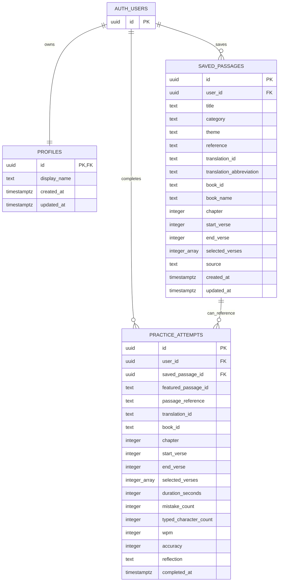
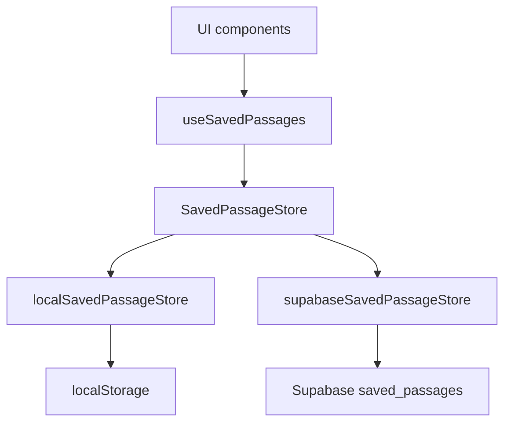
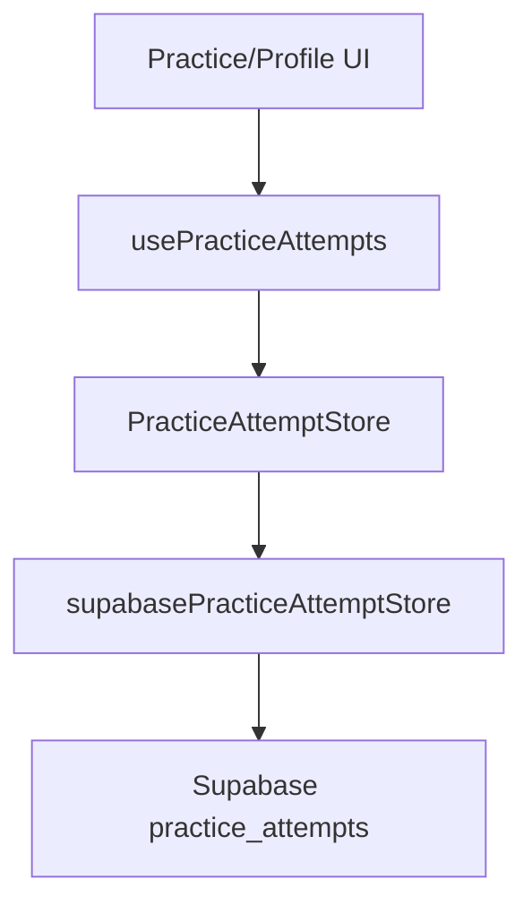
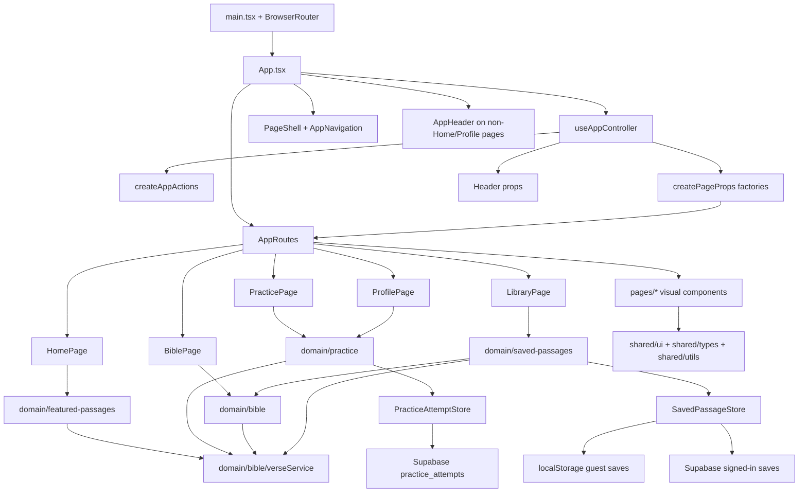

# The Word per Minute Documentation

Document version: `260714.1.a`
Last updated: 14/07/26
Update rule: only update this file when explicitly requested by the project owner.

## Purpose

The Word per Minute is a Bible typing practice app. It helps users practise typing while reading, discovering, selecting, saving, and revisiting Bible passages.

The current product direction is:

- Home introduces the app and lets users choose a practice direction.
- Practice is the central typing page.
- Featured passages introduce users to curated scripture.
- Bible lets users read chapters and select verses to save.
- Library lets users manage saved passages.
- Saved passages can be practised from Practice.
- Profile shows signed-in practice history, progress, and reflections.

Version history and documentation update notes live in `docs/update-notes.md`.

## Tech Stack

- Vite
- React
- TypeScript
- React Router
- Tailwind CSS
- Headless UI for accessible disclosure, dialog, popover, and transition primitives
- Local JSON Bible data
- Supabase JavaScript client for authentication, signed-in saved passages, and signed-in practice history
- `localStorage` for guest saved passages and theme preference

Supabase/Postgres is now used for authentication, signed-in saved passages, signed-in practice attempts, and reflections. Guest saved passages still use browser storage; guest practice attempts are not persisted.

## High-Level Architecture

The app uses URL-based React routing with page folders, domain modules, shared primitives, and a central app controller.

```txt
URL route -> App shell -> app controller -> page-prop factories -> page component -> page UI
                                           -> domain hooks/services
```

The main architecture layers are:

- `src/app`: app-level shell, routing, controllers, navigation, and coordination hooks.
- `src/pages`: screen-level pages and page-owned visual components.
- `src/domain`: app concepts, data access, persistence, hooks, calculations, and business rules.
- `src/shared`: generic UI primitives, utilities, and TypeScript data shapes.
- `src/data`: local Bible and featured-passage JSON data.
- `src/theme.css`: semantic light/dark color tokens exposed through Tailwind.
- `public/brand`: theme-aware application symbol assets.
- `vercel.json`: Vercel SPA route rewrite configuration.

## Routes

The app is a single page app with proper URL routes:

```txt
/          Home
/practice  Practice
/bible     Bible
/library   Library
/profile   Profile / Progress
```

`BrowserRouter` is installed in `src/main.tsx`.

`src/app/components/AppRoutes.tsx` maps paths to pages:

```txt
/          -> HomePage
/practice  -> PracticePage
/bible     -> BiblePage
/library   -> LibraryPage
/profile   -> ProfilePage
```

`useAppNavigation` derives the current `appMode` from the URL path. The URL is the source of truth for which screen is active.

## App Pages

### Home

Home is the starting screen.

It:

- shows primary entry points for Practice, Bible, and Library,
- shows animated counters for curated and saved passage counts,
- starts a random featured passage,
- starts a random featured passage from a chosen category,
- presents featured categories as a balanced desktop grid,
- opens the Bible reader,
- opens Library when saved passages exist.

### Practice

Practice is the central typing flow.

It:

- practises a featured passage or saved passage,
- treats the selected verses as one continuous typing passage,
- displays the passage itself as the typing surface,
- captures typing through an invisible input layer rather than a visible textarea,
- displays the passage in a fixed-height viewport that users cannot scroll manually,
- automatically scrolls the passage to keep the active typing position visible,
- calculates WPM continuously while an attempt is active,
- counts typing mistakes in accuracy even when the user later corrects them,
- treats deletion as neutral rather than as an additional mistake,
- freezes the final WPM and accuracy when the passage is completed,
- shows completion as an overlay on the passage with final WPM, final accuracy, and next actions,
- allows featured passages to be saved from the Practice controls,
- lets users switch between Featured and Saved practice sources,
- presents source and saved-passage controls in a responsive, label-first layout,
- keeps the Practice setup heading visible while letting users collapse or expand the setup controls,
- shows live WPM, accuracy, progress, and status as one quiet horizontal summary while typing,
- saves completed attempts for signed-in users,
- lets signed-in users add a post-practice reflection from a focused modal after completing a passage,
- closes the reflection modal after a successful save and leaves it open if saving fails.

### Bible

Bible is the reader and passage-selection flow.

It:

- lets the user choose translation, book, and chapter,
- displays the whole chapter,
- lets the user click individual verses,
- lets the user drag-select verse ranges,
- treats an empty verse selection as the whole current chapter,
- lets the user save selected verses with a custom title and category,
- lets the user save the whole chapter when no individual verses are selected,
- can open a random featured passage in context,
- waits for the selected chapter to render before scrolling to highlighted verses,
- uses a softer selected-verse treatment in light mode while retaining strong dark-mode contrast.

Bible does not show typing input directly.

### Library

Library is the saved-passage management flow.

It:

- reads saved passages from the active saved-passage store,
- shows `localStorage` saves for signed-out guests,
- shows Supabase cloud saves for signed-in users,
- displays saved passages as cards,
- supports search by title, reference, category, book, or translation,
- supports category filtering,
- supports source filtering by All sources, Featured, or Saved,
- lets the user practise a saved passage,
- lets the user open a saved passage in its original Bible context,
- restores exact custom verse selections when opening them in Bible,
- highlights the full range for saved featured passages,
- opens whole-chapter saves without individual verse highlighting,
- lets the user edit saved passage title/category,
- lets the user remove saved passages,
- animates card state changes for edit and remove confirmation,
- shows clearer card metadata, source labels, saved dates, and active practice state,
- separates passage actions from edit/remove actions,
- gives removal a restrained destructive treatment.

Library does not show typing input directly.

### Profile / Progress

Profile is the signed-in progress view.

It:

- shows the active account,
- summarizes completed sessions, saved reflections, average accuracy, and best WPM,
- lists recent signed-in practice attempts from Supabase,
- shows WPM, accuracy, and duration for each attempt,
- previews saved reflections with a Headless UI disclosure-backed "View full reflection" control,
- keeps long reflections from making history cards overly tall.

Signed-out users see a prompt to create an account before progress can sync.

## App Runtime Flow

```txt
main.tsx
  -> BrowserRouter
  -> App.tsx
    -> calls useAppController
      -> derives appMode from URL
      -> loads feature hooks
      -> builds display state
      -> builds cross-page actions
      -> prepares page props through plain factory functions
    -> renders PageShell with sticky branded navigation and floating utility controls
    -> renders AppHeader on non-Home and non-Profile pages
    -> renders AppRoutes
      -> renders HomePage, PracticePage, BiblePage, LibraryPage, or ProfilePage
```

`App.tsx` is mostly the app shell. App-wide coordination lives in `src/app/controllers/useAppController.ts`. Cross-page actions are created by `createAppActions.ts`, while page-specific prop wiring is grouped into the plain factory functions in `createPageProps.ts`.

The controller composes domain hooks and services, then passes prepared data and callbacks into page components. Page folders should stay mostly visual; domain folders should own app rules, persistence, transformations, and reusable data behaviour.

Home intentionally hides `AppHeader` so the Home hero is the first page content. Profile also hides `AppHeader` because it has its own progress heading. Practice, Bible, and Library still show the contextual page title/reference area.

## Current File Structure

```txt
src/
  app/
    components/
      AppErrorState.tsx
      AppFooter.tsx
      AppHeader.tsx
      AppLoadingState.tsx
      BackToTopButton.tsx
      AuthControls.tsx
      AppRoutes.tsx
      AppNavigation.tsx
      PageShell.tsx
      PassageSaveControls.tsx
      auth/
        AuthMenuButton.tsx
        SignedInAuthMenu.tsx
        SignedOutAuthMenu.tsx
    controllers/
      createAppActions.ts
      createPageProps.ts
      useAppController.ts
    hooks/
      useAppDisplayState.ts
      useAppModeEffects.ts
      useAppNavigation.ts
      useTheme.ts
    routes/
      appRoutePaths.ts
  domain/
    auth/
      useAuthSession.ts
    bible/
      hooks/
        useReaderSelection.ts
        useVerseLibrary.ts
      verseService.ts
    featured-passages/
      hooks/
        useFeaturedPassages.ts
        usePassageCategories.ts
    practice/
      hooks/
        usePracticeAttempts.ts
        usePracticePassage.ts
        usePracticeSession.ts
      stores/
        practiceAttemptStore.ts
        supabasePracticeAttemptStore.ts
      utils/
        practicePassage.ts
        typingMetrics.ts
    saved-passages/
      hooks/
        usePassageSaveInput.ts
        useSavePassageForm.ts
        useSavedPassages.ts
      stores/
        localSavedPassageStore.ts
        savedPassageStore.ts
        supabaseSavedPassageStore.ts
      savedPassageIdentity.ts
      savedPassageCategories.ts
  pages/
    bible/
      components/
        BibleChapterReader.tsx
        BibleReaderControls.tsx
      BiblePage.tsx
    home/
      HomePage.tsx
    library/
      components/
        SavedPassageCard.tsx
        SavedPassageFilters.tsx
        SavedPassageLibrary.tsx
      LibraryPage.tsx
    practice/
      components/
        FeaturedSaveAction.tsx
        PracticeActionButtons.tsx
        PracticeControls.tsx
        PracticePassageDisplay.tsx
        PracticeReflectionDialog.tsx
        PracticeTypingSurface.tsx
        SavedPassageSelect.tsx
        SourcePicker.tsx
        TypingPracticePanel.tsx
      PracticePage.tsx
    profile/
      ProfilePage.tsx
  shared/
    lib/
      supabaseClient.ts
    types/
      app.ts
      featuredPassage.ts
      practice.ts
      savedPassage.ts
      verse.ts
    ui/
      Button.tsx
    utils/
      errors.ts
      passageReference.ts
  data/
    bibles/
    featuredPassages.json
    translations.json
  App.tsx
  index.css
  main.tsx
  theme.css

public/
  brand/
    symbol-dark.svg
    symbol-light.svg
  favicon.svg

supabase/
  schema.sql

.env.example
vercel.json
```

## Key Files And Responsibilities

### `src/main.tsx`

Mounts React and wraps the app in `BrowserRouter`.

### `src/App.tsx`

Renders the app shell.

Responsibilities:

- calls `useAppController`,
- renders loading and error states,
- renders `PageShell` with global navigation/theme state,
- renders `AppHeader` on non-Home and non-Profile pages,
- renders `AppRoutes`.

### `src/app/controllers/useAppController.ts`

Coordinates app-wide state and cross-feature wiring.

Responsibilities:

- derives `appMode` through `useAppNavigation`,
- keeps `practiceSource` state,
- loads feature hooks,
- builds the active continuous practice passage,
- builds display labels/loading/error state,
- builds cross-page actions,
- handles one-shot account-menu requests from Home,
- prepares header props,
- prepares routed page props through plain factory functions.

### `src/app/controllers/createAppActions.ts`

Creates the cross-page action functions used to coordinate navigation and multiple feature stores.

The name intentionally does not use the React `use` prefix because this module does not call hooks.

### `src/app/controllers/createPageProps.ts`

Contains the plain page-prop factory functions:

- `createHomePageProps`
- `createPracticePageProps`
- `createBiblePageProps`
- `createLibraryPageProps`
- `createProfilePageProps`

### `src/app/components/AppRoutes.tsx`

Defines the app's URL routes and maps prepared page props directly to page elements.

### `src/app/components/AppHeader.tsx`

Shows the current title, subtitle, reference, and contextual passage-save controls on non-Home and non-Profile pages.

### `src/app/components/AppNavigation.tsx`

Shows the global Home / Practice / Bible / Library navigation in the app shell.

### `src/app/components/AppFooter.tsx`

Provides a quiet ending to every page.

It includes:

- the app symbol, name, and purpose,
- a notice that guest data remains local while signed-in data can sync,
- World English Bible public-domain attribution,
- a link to the GitHub repository,
- the current copyright year.

### `src/app/components/PageShell.tsx`

Provides the app page frame:

- linked brand symbol and app title,
- sticky icon-supported global navigation,
- Supabase email/password sign-in, account creation, and sign-out controls,
- floating light/dark theme button,
- main content width,
- app background,
- application footer,
- back-to-top button on long reader/list pages.

### `src/app/components/BackToTopButton.tsx`

Shows a small circular floating arrow button on long pages.

Current behaviour:

- only enabled on Bible and Library,
- fades into view after the user scrolls down,
- smoothly scrolls the window back to the top,
- supports light and dark mode.

### `src/app/components/AuthControls.tsx`

Shows the first Supabase email/password authentication UI in the app shell.

Current behaviour:

- presents auth through a compact icon-triggered dropdown,
- uses Headless UI popover behaviour for the account/auth dropdown,
- accepts an email address,
- accepts a password,
- signs in existing Supabase users,
- creates new Supabase users,
- shows a signed-in user's email after the session is established,
- lets signed-in users sign out,
- closes the dropdown on outside click, Escape, successful sign-in, and sign-out,
- links signed-in users to the Profile/Progress page,
- supports one-shot requests from Home to open the account menu in sign-up mode,
- enables signed-in saved-passage and practice-history storage by establishing the active Supabase user.

Supabase Auth redirect URLs must include the local development URL and deployed Vercel URL before email confirmation redirects are reliable in both environments.

### `src/shared/ui/Button.tsx`

Provides the shared visual hierarchy for ordinary app actions.

Current variants:

- primary,
- secondary,
- ghost,
- danger.

Specialized controls such as navigation tabs, Practice source choices, verse buttons, and the back-to-top button retain their own styling.

### `src/app/hooks/useTheme.ts`

Owns the browser theme preference and stores it in `localStorage`.

### `src/theme.css`

Defines the app's semantic Tailwind v4 color system.

It maps light and dark CSS variables to utilities for:

- canvas and surfaces,
- primary, muted, and subtle text,
- ordinary and strong borders,
- neutral actions,
- ember accents,
- selected states.

### `src/shared/lib/supabaseClient.ts`

Creates the browser-safe Supabase client from Vite environment variables.

Current status:

- reads `VITE_SUPABASE_URL`,
- reads `VITE_SUPABASE_PUBLISHABLE_KEY`,
- is used by Supabase Auth,
- is used by signed-in saved-passage storage,
- is used by signed-in practice-attempt storage,
- relies on Supabase Row Level Security and table grants before user-owned tables are queried from the browser.

### `src/domain/bible/verseService.ts`

API-shaped local data service.

Responsibilities:

- list translations,
- list books,
- load a chapter,
- list featured passages,
- resolve featured passages,
- resolve saved/custom passage references.

This should stay API-shaped so local JSON can later move to hosted data.

### `src/domain/auth/useAuthSession.ts`

Tracks the current Supabase Auth session.

Current behaviour:

- loads the current session from Supabase Auth,
- subscribes to future auth state changes,
- exposes loading, error, session, user, and signed-in state,
- exposes email/password sign-in, account creation, and sign-out actions,
- provides the signed-in user id used by cloud saved-passage storage,
- provides the signed-in user id used by cloud practice-attempt storage,
- does not replace guest `localStorage` saved passages.

### `supabase/schema.sql`

Defines the first Supabase database schema.

It creates:

- `profiles`,
- `saved_passages`,
- `practice_attempts`,
- timestamp update trigger helpers,
- a profile creation trigger for new Supabase Auth users,
- indexes for common user-owned queries,
- Row Level Security policies for user-owned access,
- grants that allow the `authenticated` role to use protected tables through the Data API.

This file is version-controlled documentation/executable setup SQL. It does not affect the live Supabase project until it is manually run in the Supabase SQL Editor.

## Page, Domain, And Shared Responsibilities

### `src/pages`

Owns route-level screens and visual composition:

- `pages/home`: Home hero, entry points, counters, and category buttons.
- `pages/practice`: Practice layout, collapsible setup controls, passage display, typing panel, and completion/reflection UI.
- `pages/bible`: Bible controls and chapter reader UI.
- `pages/library`: saved-passage list, filters, cards, and card actions.
- `pages/profile`: signed-in progress summary, recent practice history, and reflection previews.

Page components should receive prepared data and callbacks. They should not own persistence, WPM calculation, Bible loading, saved-passage identity rules, or cross-page coordination.

### `src/domain/practice`

Owns typing-practice rules:

- active practice passage creation,
- live WPM timing,
- mistake-aware accuracy session state,
- completion detection,
- signed-in practice-attempt loading and saving,
- reflection updates for completed signed-in attempts,
- `PracticeAttemptStore` abstraction,
- Supabase practice-attempt store for signed-in history,
- pure typing metric and character-equivalence logic.

### `src/domain/auth`

Owns authentication-facing app logic.

Current status:

- contains a Supabase session observer hook,
- supports email/password sign-in, account creation, and sign-out through the app shell,
- supplies the active user id used by signed-in saved-passage persistence,
- does not yet own profile editing.

### `src/domain/bible`

Owns Bible data and reader selection logic:

- translation/book/chapter loading,
- local JSON Bible data access,
- featured and saved passage resolution,
- click and drag verse selection state,
- selected-verse focus triggers.

`verseService` stays API-shaped so local JSON can later move to hosted data without rewriting page UI.

### `src/domain/featured-passages`

Owns curated passage discovery:

- featured passage loading,
- random featured passage selection,
- focused featured category derivation,
- saved-passage category derivation from featured themes.

### `src/domain/saved-passages`

Owns saved passage storage and save rules:

- save input creation,
- save form state,
- saved-passage list/update/remove state,
- saved-passage identity,
- saved-passage category defaults,
- `SavedPassageStore` abstraction,
- `localStorage` store for signed-out guests,
- Supabase store for signed-in users,
- local/cloud library separation.

Storage files:

- `savedPassageIdentity.ts`: stable passage identity independent of database row ids.
- `stores/savedPassageStore.ts`: shared `list` / `save` / `update` / `remove` contract.
- `stores/localSavedPassageStore.ts`: browser storage implementation for guest saves.
- `stores/supabaseSavedPassageStore.ts`: Supabase implementation for signed-in saves.

### `src/shared`

Owns generic reusable code that does not represent a specific app domain:

- `shared/ui/Button.tsx`: ordinary app action button hierarchy.
- `shared/utils/errors.ts`: unknown-error message extraction.
- `shared/utils/passageReference.ts`: generic passage-reference formatting.
- `shared/types`: shared app, Bible, passage, saved-passage, and practice type shapes.

## Data Files

- `src/data/featuredPassages.json`: curated passage references.
- `src/data/translations.json`: available translations.
- `src/data/bibles/web`: local World English Bible data.

Bible data structure:

```txt
src/data/bibles/web/
  manifest.json
  books/
    Gen.json
    Exod.json
    ...
```

Featured passage data currently contains 22 curated passages. Themes are intentionally broad so the Home category picker stays useful rather than diluted:

- Character & Endurance
- Faith & Trust
- Hope
- Kingdom
- Love & Grace
- Peace & Comfort
- Prayer
- Wisdom

## Deployment

The app is configured for Vercel as a Vite single page app.

Build settings:

- Build Command: `npm run build`
- Output Directory: `dist`
- Install Command: `npm install`
- Environment Variables: `VITE_SUPABASE_URL`, `VITE_SUPABASE_PUBLISHABLE_KEY`

`vercel.json` rewrites all requests to `/index.html` so browser routes such as `/practice`, `/bible`, `/library`, and `/profile` keep working when opened directly or refreshed.

## Backend Architecture

The backend direction is Supabase with Postgres, Supabase Auth, and Row Level Security. Supabase currently handles authentication, signed-in saved passages, and signed-in practice history.

Vercel remains responsible for hosting the Vite frontend. Supabase is responsible for cloud user data:

```txt
Browser
  -> Vercel-hosted React/Vite app
    -> Supabase Auth
    -> Supabase Postgres
      -> Row Level Security policies
```

The first backend phase does not move Bible text into the database. Bible data stays local while the app validates user accounts, synced saved passages, practice history, and reflections.

Current backend scope:

- Supabase Auth for user accounts and sessions.
- Postgres table for user-owned saved passages.
- Postgres table for signed-in practice attempts and reflections.
- Guest saved passages retained through `localStorage`.
- Signed-in saved passages loaded from Supabase.
- Signed-in practice history loaded from Supabase.
- Guest and cloud saved-passage libraries intentionally separated.

Planned backend scope:

- Richer progress summaries derived from Postgres practice history.
- Optional signed-in import flow from existing `localStorage` saved passages.

Out of initial backend scope:

- Hosted Bible text.
- Multiple licensed Bible translations.
- Admin UI for featured passages.
- Public sharing or community passage collections.
- Custom Node/Express API.

### Supabase Environment Variables

Vite requires browser-exposed environment variables to use the `VITE_` prefix:

```txt
VITE_SUPABASE_URL
VITE_SUPABASE_PUBLISHABLE_KEY
```

The Supabase publishable key is intended for browser use when tables are protected by Row Level Security. Supabase secret keys must never be exposed to the Vite frontend.

`.env.example` documents the required local variable names. `.env.local` should be used for real local secrets and remains ignored by Git through the existing `*.local` rule.

### Database Tables

Initial tables are defined in `supabase/schema.sql`:



```txt
profiles
  id uuid primary key references auth.users(id)
  display_name text
  created_at timestamptz

saved_passages
  id uuid primary key
  user_id uuid references auth.users(id)
  title text
  category text
  theme text
  reference text
  translation_id text
  translation_abbreviation text
  book_id text
  book_name text
  chapter integer
  start_verse integer
  end_verse integer
  selected_verses integer[]
  source text
  created_at timestamptz
  updated_at timestamptz

practice_attempts
  id uuid primary key
  user_id uuid references auth.users(id)
  saved_passage_id uuid null references saved_passages(id)
  featured_passage_id text null
  passage_reference text
  translation_id text
  book_id text
  chapter integer
  start_verse integer
  end_verse integer
  selected_verses integer[]
  duration_seconds integer
  mistake_count integer
  typed_character_count integer
  wpm integer
  accuracy integer
  reflection text
  completed_at timestamptz
```

Possible later tables:

```txt
featured_passages
passage_categories
translations
books
chapters
verses
```

Featured passages can remain local JSON until the app needs admin editing or remote content management.

### Row Level Security And Grants

Every user-owned table enables Row Level Security in `supabase/schema.sql`.

Policy shape:

- signed-in users can read their own profile,
- signed-in users can insert/update their own profile,
- signed-in users can read their own saved passages,
- signed-in users can insert/update/delete their own saved passages,
- signed-in users can read their own practice attempts,
- signed-in users can insert their own practice attempts,
- signed-in users can update reflection text on their own practice attempts.

Practice attempts are mostly append-only from the browser client. The schema lets authenticated users insert attempts and later update the `reflection` column on their own attempts, but it does not provide delete policies for attempts.

The schema also grants table access to the Supabase `authenticated` role. This is required in addition to RLS policies: grants allow the role to use the table, while RLS decides which rows that user may access.

Public Bible or featured-passage tables, if added later, can use read-only public policies after translation licensing is confirmed.

### Saved Passage Storage Strategy

Saved passages use a domain store abstraction so the UI does not know whether data is stored locally or in Supabase:



Current behaviour:

- signed-out users see and manage `localStorage` saved passages,
- signed-in users see and manage Supabase saved passages,
- switching auth state clears the previous store's list before loading the new store,
- local saves are not editable/deletable while signed in because they are not shown in signed-in mode,
- importing local saves into a signed-in account remains a future flow.

The current boundaries should keep future migration incremental:

- keep `verseService` local/API-shaped for Bible and featured passage reads,
- keep the raw Supabase client in `src/shared/lib`,
- keep auth-facing behaviour in `src/domain/auth`,
- keep saved-passage persistence behind `SavedPassageStore`,
- keep guest `localStorage` behaviour separate from signed-in cloud saves,
- offer a one-time import from local saved passages after sign-in.

### Practice Attempt Storage Strategy

Practice attempts use a separate domain store abstraction from saved passages:



Current behaviour:

- signed-in completed attempts are saved to Supabase,
- signed-in users can view recent attempts on Profile/Progress,
- signed-in users can add or update reflection text on a completed attempt,
- guest completed attempts are not persisted.

The split keeps typing UI focused on practice state while persistence details stay in `src/domain/practice/stores`.

### Supabase Auth Redirect URLs

Email/password account creation may still need Supabase Auth redirect URLs when email confirmation is enabled.

Local development:

```txt
http://localhost:5173
```

Production:

```txt
https://thewordperminute.vercel.app
```

Add these in the Supabase dashboard before relying on email confirmation across environments.

## Theme And Motion

`src/index.css` contains the global CSS entry point and motion helpers:

- Tailwind import,
- semantic theme import,
- Tailwind v4 class-based dark mode variant,
- stable scrollbar gutter for modal/popover scroll-lock behaviour,
- browser body margin reset,
- page enter animation,
- Home section rise-in animation,
- shared popover/panel/dialog entrance helpers,
- subtle hover motion helpers.

Headless UI is used for interactive motion primitives where behaviour and accessibility matter:

- Practice setup uses `Disclosure` with a Tailwind grid-row height transition.
- Practice reflections use `Dialog` with Headless UI enter/leave transition states.
- Auth/account controls use `Popover` with Headless UI enter/leave transition states.
- Saved passage card edit/remove states use `Transition`.
- Profile reflection previews use `Disclosure` with Tailwind max-height clipping and expanded scrolling for very long reflections.

Theme state is managed by `src/app/hooks/useTheme.ts` and stored in `localStorage`.

`src/theme.css` defines semantic colors with CSS variables and Tailwind v4's `@theme inline`. Components use names such as `canvas`, `surface`, `ink`, `line`, `action`, `accent`, and `selected` instead of depending directly on palette shades.

The current visual direction uses:

- warm stone surfaces for the light and dark foundations,
- slate-influenced text for clear reading contrast,
- a restrained roasted-ember orange for active, selected, and primary states,
- neutral action colors for ordinary controls,
- rose feedback for destructive and typing-error states.

Ordinary buttons share `src/shared/ui/Button.tsx`, while specialized controls retain local styling backed by the same semantic palette. Form controls remain in their owning components and should only become a shared primitive if those styles begin to drift again.

Heroicons supplies interface icons. Icons support labels and meaning rather than replacing important action text. The header uses separate light/dark transparent symbol assets, while `public/favicon.svg` adapts to the browser's color scheme.

## Important Types

- `src/shared/types/app.ts`: route-backed app modes, practice source, and theme.
- `src/shared/types/featuredPassage.ts`: featured passage references and resolved passage responses.
- `src/shared/types/practice.ts`: practice statistics, typing status, continuous passage shape, completion results, and practice-attempt records.
- `src/shared/types/savedPassage.ts`: saved passage and save input shapes.
- `src/shared/types/verse.ts`: Bible translation, book, chapter, and verse shapes.

## Current Architecture Diagram



## Known Technical Debt

- `useAppController` is the main app composition root and should not become a dumping ground for feature logic.
- The UI overhaul still needs a final desktop visual QA pass in light and dark mode.
- Category management is still generated from featured themes.
- Library filtering is UI-only and runs against whichever saved-passage store is active.
- Guest saved passages and signed-in cloud saved passages are intentionally separate, but there is no import flow yet.
- Guest users do not yet have a durable practice-history list.
- The app uses local JSON Bible data only; no hosted API yet.
- Form-control styling is repeated across components and may later benefit from a small shared primitive if it begins to drift.
- Motion now has shared reduced-motion handling, but still needs final visual QA across light and dark mode.
- Saved-passage removal has confirmation but no undo.
- Automated tests are not set up yet.
- Vercel deployment configuration is present, but the hosted deployment still needs manual verification.
- Supabase Auth, signed-in saved-passage persistence, and signed-in practice-attempt persistence are implemented.
- Bible translation licensing must be resolved before hosting additional Bible text.

## Confirmed Product Decisions

- Accuracy counts mistakes made during an attempt, including mistakes that are later corrected. Deletion itself is neutral.
- WPM updates while an attempt is active and freezes when the passage is completed.
- Practice uses one continuous typing target rather than advancing through two-verse batches.
- Practice uses a Monkeytype-style interaction where the passage is the typing surface and the visible textarea is removed.
- The Practice passage viewport uses a stable height so the page does not jump with verse length.
- Practice setup controls should be collapsible so the page can become quieter during focused typing.
- Post-practice reflections open in a focused modal rather than expanding the completed practice panel.
- In Bible mode, saving with no selected verses intentionally saves the whole current chapter.
- Saved passages can be reopened from Library in their original Bible context.
- Saved featured passages highlight their full verse range, exact custom selections retain their selected verses, and whole-chapter saves open without individual highlights.
- Vercel is the planned frontend deployment platform.
- The app uses a warm stone foundation with a restrained ember accent rather than bright blue primary actions.
- Interface icons are contextual aids and should remain paired with text for important actions.
- The header brand uses the standalone symbol beside live HTML text rather than embedding the full wordmark.
- Featured passage themes should stay broad and navigational; narrower topical distinctions can become tags later if the passage library grows.
- Desktop keyboard practice is the current priority; mobile-specific optimization is not a near-term focus.
- Supabase/Postgres is the preferred backend direction over a custom Node/Express API for the first cloud-sync phase.
- Bible text should stay local during the first backend phase; user-owned saved passages and practice history should move first.

## Likely Next Architecture Steps

1. Add a one-time local saved-passage import flow after sign-in.
2. Add richer Supabase-backed progress summaries as the practice-history dataset grows.
3. Run a final desktop visual QA pass for motion, focus states, and light/dark contrast.
4. Consider custom SMTP/auth email delivery through Supabase and a provider such as Resend.
5. Keep `useAppController` limited to cross-feature composition.
6. Keep `verseService` API-shaped so local JSON can later move to hosted data if licensing allows it.
