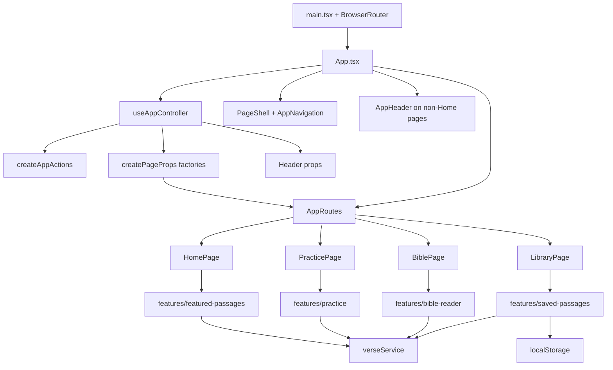

# The Word per Minute Documentation

Document version: `260619.1.a`
Last updated: 19/06/26
Update rule: only update this file when explicitly requested by the project owner.

## Purpose

The Word per Minute is a Bible typing practice app. It helps users practise typing while reading, discovering, selecting, saving, and revisiting Bible passages.

The current product direction is:

- Home introduces the app and lets users choose a practice direction.
- Practice is the central typing page.
- Featured passages introduce users to curated scripture.
- Bible lets users read chapters and select verses to save.
- Library lets users manage saved passages.
- Saved passages can be practised from Practice.

Version history and documentation update notes live in `docs/update-notes.md`.

## Tech Stack

- Vite
- React
- TypeScript
- React Router
- Tailwind CSS
- Local JSON Bible data
- `localStorage` for saved passages, personal best stats, and theme preference

No backend, database, authentication, or external Bible API is currently used.

## High-Level Architecture

The app uses URL-based React routing with feature folders and a central app controller.

```txt
URL route -> App shell -> app controller -> page-prop factories -> page component -> feature components/hooks
```

The main architecture layers are:

- `src/app`: app-level shell, routing, controllers, navigation, and coordination hooks.
- `src/pages`: screen-level page components.
- `src/features`: feature-specific UI, hooks, and services.
- `src/services`: shared service layer for local Bible data.
- `src/types`: shared TypeScript data shapes.
- `src/utils`: shared pure helper functions.
- `src/data`: local Bible and featured-passage JSON data.

## Routes

The app is a single page app with proper URL routes:

```txt
/          Home
/practice  Practice
/bible     Bible
/library   Library
```

`BrowserRouter` is installed in `src/main.tsx`.

`src/app/components/AppRoutes.tsx` maps paths to pages:

```txt
/          -> HomePage
/practice  -> PracticePage
/bible     -> BiblePage
/library   -> LibraryPage
```

`useAppNavigation` derives the current `appMode` from the URL path. The URL is the source of truth for which screen is active.

## App Pages

### Home

Home is the starting screen.

It:

- shows primary entry points for Practice, Bible, and Library,
- shows animated counters for curated and saved passage counts,
- starts a random featured passage,
- starts a random featured passage from a chosen category,
- opens the Bible reader,
- opens Library when saved passages exist.

### Practice

Practice is the central typing flow.

It:

- practises a featured passage or saved passage,
- presents the passage as short typing batches,
- calculates WPM and accuracy,
- records personal bests locally,
- allows featured passages to be saved from the Practice controls,
- lets users switch between Featured and Saved practice sources.

### Bible

Bible is the reader and passage-selection flow.

It:

- lets the user choose translation, book, and chapter,
- displays the whole chapter,
- lets the user click individual verses,
- lets the user drag-select verse ranges,
- treats an empty verse selection as the whole current chapter,
- lets the user save selected verses with a custom title and category,
- lets the user save the whole chapter when no individual verses are selected,
- can open a random featured passage in context and scroll to the selected verses.

Bible does not show typing input directly.

### Library

Library is the saved-passage management flow.

It:

- reads saved passages from `localStorage`,
- displays saved passages as cards,
- supports search by title, reference, category, book, or translation,
- supports category filtering,
- supports source filtering by All sources, Featured, or Saved,
- lets the user practise a saved passage,
- lets the user edit saved passage title/category,
- lets the user remove saved passages,
- shows clearer card metadata, source labels, saved dates, and active practice state.

Library does not show typing input directly.

## App Runtime Flow

```txt
main.tsx
  -> BrowserRouter
  -> App.tsx
    -> calls useAppController
      -> derives appMode from URL
      -> loads feature hooks
      -> builds display state
      -> builds cross-page actions
      -> prepares page props through plain factory functions
    -> renders PageShell with sticky global brand/navigation/theme controls
    -> renders AppHeader on non-Home pages
    -> renders AppRoutes
      -> renders HomePage, PracticePage, BiblePage, or LibraryPage
```

`App.tsx` is mostly the app shell. App-wide coordination lives in `src/app/controllers/useAppController.ts`. Cross-page actions are created by `createAppActions.ts`, while page-specific prop wiring is grouped into the plain factory functions in `createPageProps.ts`.

Home intentionally hides `AppHeader` so the Home hero is the first page content. Practice, Bible, and Library still show the contextual page title/reference area.

## Current File Structure

```txt
src/
  app/
    components/
      AppErrorState.tsx
      AppHeader.tsx
      AppLoadingState.tsx
      BackToTopButton.tsx
      AppRoutes.tsx
      AppNavigation.tsx
      PageShell.tsx
      PassageSaveControls.tsx
    controllers/
      createAppActions.ts
      createPageProps.ts
      useAppController.ts
    hooks/
      useAppDisplayState.ts
      useAppModeEffects.ts
      useAppNavigation.ts
      useTheme.ts
    routes/
      appRoutePaths.ts
  features/
    bible-reader/
      components/
        BibleChapterReader.tsx
        BibleReaderControls.tsx
      hooks/
        useReaderSelection.ts
        useVerseLibrary.ts
    featured-passages/
      hooks/
        useFeaturedPassages.ts
        usePassageCategories.ts
    practice/
      components/
        FeaturedSaveAction.tsx
        PersonalBests.tsx
        PracticeActionButtons.tsx
        PracticeBatchDisplay.tsx
        PracticeControls.tsx
        SavedPassageSelect.tsx
        SourcePicker.tsx
        TypingPracticePanel.tsx
      hooks/
        usePracticeBatches.ts
        usePracticeSession.ts
        usePracticeStats.ts
      utils/
        practiceBatches.ts
        typingMetrics.ts
    saved-passages/
      components/
        SavedPassageCard.tsx
        SavedPassageFilters.tsx
        SavedPassageLibrary.tsx
      constants/
        savedPassageCategories.ts
      hooks/
        usePassageSaveInput.ts
        useSavePassageForm.ts
        useSavedPassages.ts
      services/
        savedPassageRepository.ts
  pages/
    BiblePage.tsx
    HomePage.tsx
    LibraryPage.tsx
    PracticePage.tsx
  services/
    verseService.ts
  data/
    bibles/
    featuredPassages.json
    translations.json
  types/
    app.ts
    featuredPassage.ts
    practice.ts
    savedPassage.ts
    verse.ts
  utils/
    errors.ts
    passageReference.ts
  App.tsx
  index.css
  main.tsx
```

## Key Files And Responsibilities

### `src/main.tsx`

Mounts React and wraps the app in `BrowserRouter`.

### `src/App.tsx`

Renders the app shell.

Responsibilities:

- calls `useAppController`,
- renders loading and error states,
- renders `PageShell` with global navigation/theme state,
- renders `AppHeader` on non-Home pages,
- renders `AppRoutes`.

### `src/app/controllers/useAppController.ts`

Coordinates app-wide state and cross-feature wiring.

Responsibilities:

- derives `appMode` through `useAppNavigation`,
- keeps `practiceSource` state,
- loads feature hooks,
- builds practice batches,
- builds display labels/loading/error state,
- builds cross-page actions,
- prepares header props,
- prepares routed page props through plain factory functions.

### `src/app/controllers/createAppActions.ts`

Creates the cross-page action functions used to coordinate navigation and multiple feature stores.

The name intentionally does not use the React `use` prefix because this module does not call hooks.

### `src/app/controllers/createPageProps.ts`

Contains the plain page-prop factory functions:

- `createHomePageProps`
- `createPracticePageProps`
- `createBiblePageProps`
- `createLibraryPageProps`

### `src/app/components/AppRoutes.tsx`

Defines the app's URL routes and maps prepared page props directly to page elements.

### `src/app/components/AppHeader.tsx`

Shows the current title, subtitle, reference, and contextual passage-save controls on non-Home pages.

### `src/app/components/AppNavigation.tsx`

Shows the global Home / Practice / Bible / Library navigation in the app shell.

### `src/app/components/PageShell.tsx`

Provides the app page frame:

- app title,
- sticky global navigation,
- theme button,
- main content width,
- app background,
- back-to-top button on long reader/list pages.

### `src/app/components/BackToTopButton.tsx`

Shows a small circular floating arrow button on long pages.

Current behaviour:

- only enabled on Bible and Library,
- appears after the user scrolls down,
- smoothly scrolls the window back to the top,
- supports light and dark mode.

### `src/app/hooks/useTheme.ts`

Owns the browser theme preference and stores it in `localStorage`.

### `src/services/verseService.ts`

API-shaped local data service.

Responsibilities:

- list translations,
- list books,
- load a chapter,
- list featured passages,
- resolve featured passages,
- resolve saved/custom passage references.

This should stay API-shaped so local JSON can later move to hosted data.

## Feature Responsibilities

### `features/practice`

Owns typing practice UI and logic:

- source controls,
- featured passage save action,
- saved passage picker,
- practice action buttons,
- typing batch display,
- typing input,
- personal bests,
- WPM/accuracy session state,
- practice batch creation,
- pure typing metric and character-equivalence logic.

### `features/bible-reader`

Owns Bible browsing and verse selection:

- translation/book/chapter controls,
- full chapter reader,
- click and drag verse selection,
- reader data-loading state.

### `features/featured-passages`

Owns curated passage discovery:

- featured passage loading,
- random featured passage selection,
- category derivation,
- Home category picker UI.

### `features/saved-passages`

Owns saved passage storage and management:

- save input creation,
- save form state,
- saved passage search/filter/list/edit/remove UI,
- saved passage cards,
- `localStorage` repository.

## Data Files

- `src/data/featuredPassages.json`: curated passage references.
- `src/data/translations.json`: available translations.
- `src/data/bibles/web`: local World English Bible data.

Bible data structure:

```txt
src/data/bibles/web/
  manifest.json
  books/
    Gen.json
    Exod.json
    ...
```

## Theme And Motion

`src/index.css` contains the small global CSS needed for Tailwind and motion:

- Tailwind import,
- Tailwind v4 class-based dark mode variant,
- browser body margin reset,
- page enter animation,
- Home section rise-in animation,
- subtle hover motion helpers.

Theme state is managed by `src/app/hooks/useTheme.ts` and stored in `localStorage`.

Theme styling is handled with Tailwind utility classes, using:

- `dark:` variants for dark mode,
- blue as the main accent color,
- slate/stone as neutral structure colors,
- soft blue states for selected items,
- blue/rose/slate feedback states for typing.

The current approach intentionally avoids a full custom design-token system. If repeated Tailwind classes become hard to maintain, extract shared button/input styles later.

## Important Types

- `src/types/app.ts`: route-backed app modes, practice source, and theme.
- `src/types/featuredPassage.ts`: featured passage references and resolved passage responses.
- `src/types/practice.ts`: practice statistics, typing metrics, and batch shapes.
- `src/types/savedPassage.ts`: saved passage and save input shapes.
- `src/types/verse.ts`: Bible translation, book, chapter, and verse shapes.

## Current Architecture Diagram



## Known Technical Debt

- `useAppController` is the main app composition root and should not become a dumping ground for feature logic.
- Accuracy currently reflects only the text presently entered. Because completion requires a fully correct passage, completed attempts always finish at 100% accuracy. The intended future behaviour is to count mistakes even when the user later corrects them.
- The random featured-passage reader action may request scrolling before the newly selected chapter has finished rendering.
- The UI overhaul still needs visual QA across desktop/mobile and light/dark mode.
- Category management is still hardcoded/generated from featured themes.
- Library filtering is UI-only and still backed by local saved passage data.
- User data is local-only through `localStorage`.
- The app uses local JSON Bible data only; no hosted API yet.
- Theme styling is repeated across components and may later benefit from small shared style helpers.
- Motion does not yet account for the user's reduced-motion preference.
- Saved-passage removal has no confirmation or undo.
- Automated tests are not set up yet.
- Vercel is the intended future deployment target, but deployment and SPA rewrite configuration are not yet included.

## Confirmed Product Decisions

- Accuracy should count mistakes made during an attempt, including mistakes that are later corrected.
- In Bible mode, saving with no selected verses intentionally saves the whole current chapter.
- Vercel is the planned future deployment platform.
- The next development priority will be chosen after further discussion.

## Likely Next Architecture Steps

1. Redesign accuracy tracking so corrected mistakes remain part of the final score.
2. Add focused automated tests for typing metrics, practice batches, passage references, saved-passage identity, and route conversion.
3. Make featured-passage reader scrolling wait for the selected chapter to render.
4. Manually test `/`, `/practice`, `/bible`, and `/library`.
5. Confirm refresh and browser back/forward work correctly on each route.
6. Visually QA the sticky header, dark mode, and back-to-top button on mobile widths.
7. Add reduced-motion handling.
8. Keep `useAppController` limited to cross-feature composition.
9. Keep `verseService` API-shaped so local JSON can later move to hosted data.
10. Keep saved passage storage behind `savedPassageRepository` so it can later move to a database.
11. Add Vercel configuration and verify SPA route fallbacks when deployment work begins.
